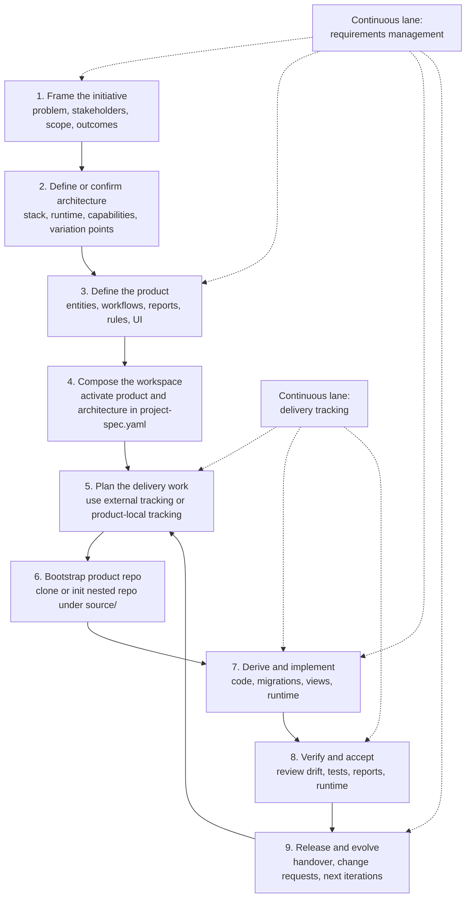

# ArchSpec

ArchSpec is a scaffolding for building applications from structured manifests instead of letting implementation details become the source of truth.

The repository is currently in the scaffolding-definition stage. That means the most important artifacts in this repo are not generated source files yet, but the contracts that describe:

- how a project is composed,
- what technical architecture it runs on,
- what a concrete product needs,
- and how future code should be derived from those definitions.

The intent is to make the scaffolding reusable across multiple applications, not only for the current example product.

## Core idea

This repository follows the `VibeArchitector` paradigm.

In this model:

- architecture is declared before implementation,
- product behavior is declared before implementation,
- code is derived from manifests,
- the manifests are the source of truth,
- and the same scaffolding should support multiple products over time.

The target operating mode for ArchSpec is `spec-as-source`.

That means the framework is intended to evolve toward manifests that can map to code and derived artifacts almost literally, with minimal hidden interpretation.

The key separation is:

- `project-spec.yaml` describes workspace composition.
- `scaffold/architecture-manifest.yaml` describes reusable technical architecture.
- `products/<slug>/product-spec.yaml` describes one concrete product.
- `source/` is the reserved product workspace where a new product repository is cloned or initialized.

That separation is the entire point of the framework.

## Slug-first bootstrap

`<slug>` is the first concrete identity decision for any new product.

It is not filler text.

The first project-creation prompt should resolve it explicitly. Canonical example:

```text
Create the project "helpdesk-lite" as a new project.
```

Before any product definition or code generation begins, that prompt should establish the active project context and map the slug to the framework anchors that depend on it.

### Slug propagation map

| File | Slug-bearing anchors | Purpose |
|---|---|---|
| `project-spec.yaml` | `workspace.source_of_truth.active_product_spec`, `modules.active_product.id`, `modules.active_product.path`, `future_products.location_pattern` | Establishes the active product identity and its manifest path, and keeps the reusable slug path pattern visible. |
| `scaffold/architecture-manifest.yaml` | `playbooks.add_new_product.steps` | Defines the bootstrap procedure for adding a product. |
| `AGENTS.md` | active product guidance and `products/<slug>/product-spec.yaml` references | Tells agents how to interpret the active product placeholder. |
| `README.md` | product creation guidance, examples, and active product explanations | Keeps human-facing instructions aligned with the slug-first rule. |
| `LIFECYCLE-ROADMAP.md` | Phase 0 active product context, deliverable paths, and validation-case language | Makes slug definition part of lifecycle entry criteria. |
| `FRAMEWORK-GAP-ANALYSIS.md` | generic `products/<slug>/product-spec.yaml` references | Keeps framework analysis reusable instead of product-specific. |

When the first prompt resolves `helpdesk-lite`, the framework should immediately interpret:

- active project: `helpdesk-lite`
- active product spec: `products/helpdesk-lite/product-spec.yaml`
- active product folder: `products/helpdesk-lite/`

## What this scaffolding is for

Use this scaffolding when you want to define an application in a disciplined, repeatable way before implementing it.

Typical goals:

- standardize how applications are described,
- make technical decisions explicit and versioned,
- let multiple products share the same core architecture,
- support AI-assisted development without losing structure,
- rebuild or regenerate applications from manifests,
- reduce the risk of business logic leaking into infrastructure definitions,
- reduce the risk of stack decisions leaking into product definitions.

## What this scaffolding is not

This repository is not yet a finished code generator.

Today it defines the contract that future code generation and implementation should follow.

That distinction matters:

- the manifests already define what should happen,
- but the generation engine and implementation modules may still be built later,
- so the current value of the repo is architectural clarity and repeatable specification,
- not a complete runnable app generator yet.

Even so, the intended destination is not merely "documentation that guides coding".

The intended destination is a `spec-as-source` framework where structured manifests become authoritative enough to drive code, documents, diagrams, migrations, and validation nearly directly.

## Repository structure

```text
.
|-- AGENTS.md
|-- FRAMEWORK-GAP-ANALYSIS.md
|-- LIFECYCLE-ROADMAP.md
|-- REFERENCES.md
|-- adrs/
|-- README.md
|-- project-spec.yaml
|-- source/                  # reserved, ignored, and typically empty until product bootstrap
|-- scaffold/
|   `-- architecture-manifest.yaml
`-- products/
    `-- <slug>/
        `-- product-spec.yaml
```

## Framework component map

The framework is not only the three manifests.

It is the combination of composition, reusable architecture, product definition, decision records, methodological guidance, and the reserved product workspace.

The table below explains what each major component is for and why it exists.

| Component | Role | Why it exists |
|---|---|---|
| `README.md` | Primary operating guide | Gives humans and agents the shared mental model for using the framework correctly. |
| `AGENTS.md` | AI operating contract | Tells AI agents which files are authoritative, how to work, and how to respect framework boundaries. |
| `project-spec.yaml` | Workspace composition manifest | Chooses the active product and architecture, defines generation scope, and defines repo-level rules. |
| `scaffold/architecture-manifest.yaml` | Reusable architecture manifest | Owns the stack, runtime, variation points, and reusable capability modules. |
| `products/<slug>/product-spec.yaml` | Concrete product manifest | Owns business behavior, domain entities, reports, workflows, UI requirements, and product rules. |
| `adrs/` | Architecture decision records | Captures durable framework-level decisions that should outlive a single iteration. |
| `REFERENCES.md` | Curated methodological base | Gives the framework a stable base of engineering concepts, heuristics, and governance guidance. |
| `LIFECYCLE-ROADMAP.md` | Formal lifecycle and deliverables guide | Expands the framework into a complete delivery lifecycle aligned to TOGAF-inspired software engineering practice. |
| `FRAMEWORK-GAP-ANALYSIS.md` | Maturity and backlog analysis | Makes current gaps explicit so framework evolution stays intentional. |
| `source/` | Reserved product repository root | Keeps product implementation physically separate from the framework and allows a nested product repo with its own `.git`. |

You can think of the framework in layers:

- `README.md`, `AGENTS.md`, `REFERENCES.md`, and `LIFECYCLE-ROADMAP.md` explain how to use the system.
- `project-spec.yaml`, `scaffold/architecture-manifest.yaml`, and `products/<slug>/product-spec.yaml` define what the system is.
- `adrs/` records durable framework decisions.
- `source/` is where the actual product repository is materialized.

## The three manifest layers

### 1. Workspace composition

File:

`project-spec.yaml`

Responsibility:

- declare the active architecture manifest,
- declare the active product spec,
- define repo-level generation scope,
- define composition rules,
- define how future products are onboarded.

This file answers:

- Which product are we building right now?
- Which technical architecture is it using?
- What kinds of artifacts should be derived?
- Which file should be edited for each type of change?

This file should stay thin.

It should not contain:

- business entities,
- business rules,
- UI workflows,
- framework internals,
- low-level runtime setup.

It is the composition layer, not the content layer.

### Delivery tracking boundary

ArchSpec does not keep an internal backlog or iteration log for framework evolution.

That is intentional.

The framework backlog is expected to live outside this repository, for example in GitHub Issues or GitHub Projects.

If a concrete application later needs an in-repository backlog, delivery log, or operational memory, that structure belongs in the product repository under `source/`, not in the framework root.

### 2. Reusable architecture

File:

`scaffold/architecture-manifest.yaml`

Responsibility:

- define the technical stack,
- define runtime and delivery shape,
- define data and migration strategy,
- define reusable capability modules,
- define variation points,
- define what generated layers are expected,
- define playbooks for architecture-level changes.

This file answers:

- What language does the backend use?
- What framework is used?
- What database engines are allowed?
- What test strategy exists?
- What reusable technical capabilities can products consume?
- What changes belong to architecture rather than business?

This file must remain domain-agnostic.

It should not contain:

- product entities,
- product-specific workflows,
- product KPIs,
- business formulas,
- product-specific terminology.

Think of it as the reusable engine room.

### Source workspace convention

The repository root is not the product runtime workspace.

The product runtime workspace is reserved under:

`source/`

That means:

- `source/` is not meant to hold framework-owned placeholder files,
- `source/` should stay absent or empty in the framework repository until implementation bootstrap,
- a new product repository may be cloned or initialized directly in `source/`,
- that product repository may own its own `.git` directory,
- a web app inside that product repository may place its internal code under `source/src/`,
- runtime artifacts such as `source/Dockerfile` belong inside that product repository,
- and the framework root remains reserved for manifests, policies, templates, generators, and methodology.

Because Git does not track empty directories, `source/` may legitimately be absent from a clean framework checkout until the product repository is created.

### 3. Product definition

File pattern:

`products/<slug>/product-spec.yaml`

Responsibility:

- define a specific product,
- define domain entities,
- define business behavior,
- define UI requirements,
- define reports, imports, and exports,
- define product evolution playbooks.

This file answers:

- What problem does this product solve?
- Which entities exist?
- Which rules define the business?
- Which screens or reports are required?
- Which architecture capabilities are needed?

This file should not decide the concrete stack when that stack is already owned by the architecture manifest.

Instead, the product should request capabilities. For example:

- `dashboard_kpi`
- `excel_report`
- `excel_template_import`

That keeps the product portable across architecture variants.

## Source of truth model

The source of truth is hierarchical:

1. direct user instructions,
2. `project-spec.yaml`,
3. the referenced manifests,
4. generated or handwritten code.

If code and manifests disagree, the manifests win unless the user explicitly asks to update them.

This rule is critical because the framework is spec-as-source, not code-first.

## The current example composition

The repository currently uses:

- workspace manifest: `project-spec.yaml`
- architecture manifest: `scaffold/architecture-manifest.yaml`
- active project placeholder: `<slug>`
- active product: `products/<slug>/product-spec.yaml`

Until the first project-creation prompt resolves a value, the active project is literally the placeholder `<slug>`. A concrete instantiation should prove that the scaffolding can represent:

- catalog CRUD,
- person-level tracking,
- dashboards,
- PDF and Excel reporting,
- template-based imports,
- product-specific business rules.

The important point is that the product is not the scaffolding itself.

The product is a tenant of the scaffolding.

## Deliverables ArchSpec should support

Removing the framework-root backlog does not reduce delivery viability.

The ability to create an application and its formal deliverables comes from:

- the three manifests,
- the decision records,
- the lifecycle guidance,
- and the reserved product repository under `source/`.

The table below describes the main deliverables that should remain viable in the current framework model.

| Deliverable | Primary source | Typical stage | Notes |
|---|---|---|---|
| Scope and requirements package | `purpose`, `requirements`, `actors`, `non_functional_requirements`, and `acceptance_criteria` in the product spec | Before code and whenever scope changes | The product spec itself is the primary requirements deliverable. |
| Requirements traceability matrix | product spec requirements, architecture capabilities, implementation slices, and tests | Definition through verification | Important for proving that requirements map to artifacts and evidence. |
| Logical data model and E-R diagram | `products/<slug>/product-spec.yaml` entities and relationships | Before code and during structural changes | Already viable from `domains.entities`; logical and visual views should stay aligned. |
| Data dictionary | product entities, field validations, business constraints, and implemented schema | Before code and during schema changes | Complements the E-R view with field-level semantics and validation rules. |
| Use-case catalog and use-case diagram | `actors`, `roles`, `use_cases`, `workflows` in the product spec | Before code and whenever scope changes | Already viable from the current product spec structure. |
| Wireframe pack and navigation model | `ui.modules`, reports, roles, workflows | Before code and after UX-affecting changes | Viable as structural wireframes today; high-fidelity design still depends on deeper UX conventions. |
| Technical solution specification | `project-spec.yaml` + `scaffold/architecture-manifest.yaml` + active `product-spec.yaml` | Before bootstrap and refreshed per major increment | Explains runtime topology, modules, data strategy, testing approach, and constraints. |
| Application architecture diagram and component decomposition | architecture manifest, capability mapping, and active product scope | Before implementation and when structure changes | Useful for showing service boundaries, modules, and major implementation pieces. |
| Component compatibility matrix | architecture technology profile, variation points, and product required capabilities | Before implementation and before release | Cross-checks stack choices, versions, and requested capabilities. |
| API specification | architecture API style plus product entities, workflows, validations, and implemented endpoints | Before implementation and refreshed during delivery | Critical for serious products even when the UI and backend are developed together. |
| Security and access matrix | roles, permissions, security NFRs, and architecture access conventions | Before implementation and verification | Especially important for internal apps with scoped visibility and edit rights. |
| Object model or OOP/class documentation | product entities plus implementation under `source/` | After the first implementation skeleton and refreshed during development | Partly spec-derived before code, strongest once classes and services exist in the product repo. |
| Test strategy, automated test suites, and execution evidence | architecture test strategy, product acceptance criteria, workflows, and implemented code | During development and verification | Unit tests are only one part; serious delivery also benefits from integration, end-to-end, and evidence artifacts. |
| Reports and import/export templates | product report/import/export sections plus architecture reporting stack | During implementation and verification | Already viable as formal outputs even before full generator automation exists. |
| Deployment guide, operations runbook, and release notes | architecture delivery profile, runtime configuration, and product release state | Before release and refreshed per operational change | Needed when the product moves from implementation to handover and support. |

This is the practical rule:

- design artifacts can be derived as soon as the product spec is rich enough,
- implementation artifacts are created under `source/` after bootstrap,
- and verification artifacts become stronger once tests and runtime exist inside the product repository.

Not every lightweight example needs every deliverable to be polished in the first iteration.

Even so, ArchSpec should make each of these deliverables expressible, traceable, and refreshable from the manifests plus the product repository under `source/`.

## Lifecycle with ArchSpec

For the full formal lifecycle and deliverable catalog, see:

`LIFECYCLE-ROADMAP.md`

The condensed lifecycle below is the practical working model for most product efforts built with this framework.



### Phase 1. Frame the initiative

Purpose:

- define why the product exists,
- identify stakeholders,
- define scope and non-scope,
- define expected outcomes and constraints.

Primary outputs:

- problem statement,
- success outcomes,
- scope,
- assumptions,
- initial requirement set.

Primary owner files:

- `products/<slug>/product-spec.yaml`
- supporting documents as needed

### Phase 2. Define or confirm architecture

Purpose:

- decide whether the existing architecture is sufficient,
- declare stack choices and runtime shape,
- declare reusable technical capabilities,
- identify technical variation points.

Primary outputs:

- validated or updated `scaffold/architecture-manifest.yaml`,
- architecture decisions in `adrs/`,
- clarified capability expectations.

Primary owner files:

- `scaffold/architecture-manifest.yaml`
- `adrs/`

### Phase 3. Define the product

Purpose:

- turn the business idea into implementation-grade product definition,
- specify entities, behaviors, workflows, permissions, reports, imports, exports, and UI modules,
- reduce hidden interpretation before code starts.

Primary outputs:

- rich `products/<slug>/product-spec.yaml`,
- derived design artifacts such as E-R diagrams, wireframes, use-case catalogs, and use-case diagrams,
- technical solution specification draft,
- component compatibility matrix draft,
- acceptance criteria.

Primary owner files:

- `products/<slug>/product-spec.yaml`

### Phase 4. Compose the workspace

Purpose:

- explicitly select which product and which architecture are active,
- define generation scope and composition rules.

Primary outputs:

- updated `project-spec.yaml`,
- explicit active context for future work.

Primary owner file:

- `project-spec.yaml`

### Phase 5. Plan the iteration

Purpose:

- make work traceable before coding,
- define one coherent change scope,
- connect the work to the chosen delivery tracker.

Primary outputs:

- backlog item, issue, or delivery ticket in the chosen tool,
- optional delivery notes in the product repository after bootstrap,
- explicit scope for the next implementation increment.

### Phase 6. Bootstrap the product repository

Purpose:

- create the physical runtime workspace for the application,
- keep the framework repo separate from the product repo,
- make room for normal software development under `source/`.

Primary outputs:

- nested product repository under `source/`,
- product-local `.git`,
- initial runtime skeleton such as `source/Dockerfile`, `source/src/`, and related files.

Primary owner path:

- `source/`

### Phase 7. Derive and implement

Purpose:

- turn the manifests into concrete software artifacts,
- implement backend, frontend, migrations, runtime, reports, and import/export flows,
- keep implementation traceable to the manifests.

Primary outputs:

- product code,
- migrations,
- report templates,
- technical solution specification updates,
- component compatibility matrix updates,
- object model or class documentation,
- unit test suites,
- runtime files,
- generated or handwritten implementation artifacts inside the product repo.

Primary owner path:

- `source/`

### Phase 8. Verify and accept

Purpose:

- check that implementation matches the manifests,
- validate tests, runtime behavior, reports, and data rules,
- decide whether the increment is acceptable.

Primary outputs:

- test evidence,
- drift review,
- refreshed design and technical deliverables when behavior changed,
- acceptance result,
- documented blockers or follow-up work.

### Phase 9. Release and evolve

Purpose:

- package the current increment,
- hand it over for operation or review,
- create the next controlled change cycle.

Primary outputs:

- release candidate or release package,
- updated delivery tracker,
- new change backlog,
- updated ADRs when structural decisions change.

The most important idea is this:

- the manifests define,
- delivery tracking coordinates,
- the nested product repository implements,
- and release decisions are made from evidence, not intuition.

## How to use this scaffolding to develop an application

The correct workflow is always:

1. define or update the right manifest,
2. record the work in the chosen tracker when needed,
3. validate the manifest boundaries,
4. bootstrap the product repository inside `source/` if it does not exist yet,
5. derive implementation work from those manifests,
6. update code, migrations, UI, and runtime artifacts inside `source/`,
7. verify that the implementation still matches the manifests,
8. update product-local delivery notes only if the concrete product uses them.

Do not start from code unless you are measuring drift or applying a previously defined manifest change.

## Recommended workflow in practice

### Step 1. Decide what kind of change you are making

Before editing anything, classify the change.

If the change is about:

- stack,
- language,
- backend framework,
- frontend framework,
- database engine,
- delivery model,
- migration conventions,
- reusable technical capability,

then edit:

`scaffold/architecture-manifest.yaml`

If the change is about:

- product purpose,
- domain entities,
- business rules,
- reports,
- import/export behavior,
- screens,
- user workflows,
- product KPIs,

then edit:

`products/<slug>/product-spec.yaml`

If the change is about:

- which product is active,
- which architecture manifest is active,
- how the repository composes modules,
- what categories of artifacts should be generated,

then edit:

`project-spec.yaml`

### Step 2. Update the manifest before code

This is the most important operating rule.

Never implement first and document later.

Instead:

1. update the manifest,
2. let the manifest describe the new truth,
3. derive code changes from it.

If the manifest cannot express a needed concept yet, extend the manifest structure first.

### Step 3. Check whether the change crosses layers

Some requests look small but actually cross boundaries.

Examples:

- "Add birth date to a person."
  This is product-level because it changes the product domain.

- "Switch from SQLite to PostgreSQL."
  This is architecture-level because it changes infrastructure strategy.

- "Add a bulk CSV import capability that future products can reuse."
  This is architecture-level because it adds a reusable capability.

- "Activate a second product using the same architecture."
  This is workspace-level because composition changes.

If a change touches more than one layer, update the owning layer first and then propagate the consequences.

### Step 4. Propagate into implementation

After the manifests are correct, implementation work may include:

- ORM models,
- API schemas,
- services,
- database migrations,
- frontend views,
- report templates,
- runtime files,
- environment configuration.

These are outputs of the manifests, not peer sources of truth.

### Step 5. Verify drift

At the end of a change, verify:

- does the code match the architecture manifest?
- does the code match the product spec?
- do migrations preserve the intended data strategy?
- do reports and UI reflect the product behavior?
- does the runtime reflect the declared technical profile?

If not, the implementation still has drift.

## How to create a new application with this scaffolding

To create a new product on top of the same scaffolding:

1. define the slug from the first project-creation prompt,
2. map that slug to the active product fields in `project-spec.yaml`,
3. create a new folder under `products/`,
4. create `products/<slug>/product-spec.yaml`,
5. describe the product purpose,
6. declare the required capabilities,
7. define its domain entities,
8. define rules, screens, reports, imports, and exports,
9. register it in `project-spec.yaml`,
10. decide whether it becomes the active product.

Canonical first prompt:

```text
Create the project "helpdesk-lite" as a new project.
```

When implementation starts, the product should be materialized under:

- `source/` as the root of the product repository
- and typically `source/src/` for its application code inside that repository.

The framework repository should not pre-populate `source/` with application files.

### Minimal example

```text
products/
`-- <slug>/
    `-- product-spec.yaml
```

Then update `project-spec.yaml` so the resolved slug becomes the active product context if needed.

## Worked example: building `helpdesk-lite` with `GPT-5.1-Codex-Max`

This example shows how a team could use ArchSpec from the very beginning of a project through the first definition and implementation cycles of a small but serious internal application.

Assumption:

- you are using Codex with the model `gpt-5.1-codex-max`,
- ArchSpec is the framework repository,
- and the new application repository will be created later under `source/`.

We will use a fictional platform called `helpdesk-lite` as the example.

Why this example is a good fit:

- it is small enough to explain end to end,
- it still has real domain complexity,
- it needs roles, workflows, states, dashboards, and reports,
- and it demonstrates the value of the framework without coupling the scaffolding to a permanent product identity.

The example product is an internal helpdesk for:

- employees who submit incidents and service requests,
- support agents who triage and resolve tickets,
- support managers who monitor queues and SLA health,
- and administrators who maintain categories and assignment rules.

Typical MVP behavior for `helpdesk-lite`:

- create and track tickets,
- classify by category and priority,
- assign tickets to agents,
- add comments and attachments,
- move tickets through a controlled status workflow,
- show queue and SLA dashboards,
- and generate operational reports.

Important maturity note:

- Steps 0 through 7 are fully compatible with the framework as it exists today.
- Steps 8 through 11 describe the intended delivery workflow, but today they are executed primarily through guided implementation by Codex rather than through a finished schema-backed generator pipeline.
- Full deterministic regeneration still depends on future work such as manifest schemas, validators, capability contracts, and generators.

### Step 0. Resolve the project slug and start the engagement correctly

Goal:

- resolve the active project identity before writing product definitions,
- start from framework context, not from random code generation.

Human actions:

1. open the ArchSpec framework repository,
2. choose `gpt-5.1-codex-max` as the working model in Codex,
3. issue a first prompt that resolves the slug in English,
4. ask Codex to map that slug to every active-product placeholder before proposing implementation,
5. decide whether the current architecture manifest can support `helpdesk-lite`.

Recommended prompt:

```text
Create the project "helpdesk-lite" as a new project.
Resolve the slug as `helpdesk-lite`, map it to every active-product placeholder in the framework, and explain which manifests must be updated before any code is written.
Read AGENTS.md, project-spec.yaml, scaffold/architecture-manifest.yaml, README.md, and REFERENCES.md.
Explain the framework boundaries and prepare to define the product without writing application code yet.
```

Expected result:

- the slug `helpdesk-lite` is fixed as the active project identity,
- the active product path `products/helpdesk-lite/product-spec.yaml` is established,
- the slug propagation targets are identified before any product content is drafted,
- Codex understands the framework,
- Codex does not jump into source code generation too early,
- and the conversation starts at the correct layer.

### Step 1. Define the business problem and scope

Goal:

- capture why the platform exists and what it must solve.

Human input examples:

- employees need a single internal place to request support,
- agents need a prioritized queue and assignment view,
- managers need visibility into open volume, response time, and SLA breaches,
- administrators need to maintain categories, priorities, and support groups,
- the first release should stay internal-only and localhost-friendly.

Recommended prompt:

```text
Create a first draft of products/helpdesk-lite/product-spec.yaml focused on business context, scope, out-of-scope boundaries, actors, and intended outcomes.
Use helpdesk-lite as an internal support ticketing platform.
Do not decide the technical stack in the product spec.
```

Expected result:

- a first product definition under `products/helpdesk-lite/product-spec.yaml`,
- explicit scope and non-scope,
- explicit actors and goals,
- a much better requirement baseline than a plain note-taking document.

At this stage, the scope should still stay compact.

A sensible MVP scope for `helpdesk-lite` would be:

- ticket submission,
- ticket assignment,
- ticket comments,
- priority and category catalogs,
- status workflow,
- agent queue,
- manager dashboard,
- PDF and Excel reports.

Out of scope for the first increment could be:

- email integration,
- chat integration,
- public portal access,
- complex SLA calendars,
- multi-company tenancy.

### Step 2. Confirm architecture fit

Goal:

- verify whether the current architecture can support the product without leaking business logic into architecture.

Questions to answer:

- does the product need dashboards,
- does it need reporting,
- does it need file uploads,
- does it need import templates now or later,
- does it need a reusable capability not yet declared by the framework.

Recommended prompt:

```text
Review the active architecture manifest and compare it to helpdesk-lite requirements.
List which existing capability modules are sufficient and which new reusable capability modules would need to be added before implementation.
```

Expected result:

- explicit fit or gap analysis,
- architecture changes, if any, applied to `scaffold/architecture-manifest.yaml`,
- no product-specific entities added to architecture by mistake.

For this example, a likely first answer would be:

- `catalog_crud` supports categories, priorities, and support groups,
- `profile_detail` supports ticket detail views,
- `dashboard_kpi` supports queue and SLA health views,
- `pdf_report` and `excel_report` support manager reporting,
- `file_asset_upload` supports ticket attachments,
- `excel_template_import` is probably optional for the MVP and can be deferred.

### Step 3. Enrich the product spec until it is implementation-grade

Goal:

- make the product spec rich enough to drive implementation with minimal hidden interpretation.

What Codex should help define for `helpdesk-lite`:

- entities and relationships,
- field validations,
- actors and roles,
- permissions,
- use cases,
- workflows,
- state models,
- dashboard definitions,
- reports,
- optional imports and exports,
- non-functional requirements,
- acceptance criteria,
- sample scenarios.

Typical first-pass entities for this example:

- `Ticket`
- `TicketComment`
- `TicketAttachment`
- `Category`
- `Priority`
- `SupportGroup`
- `AgentAssignment`
- `TicketStatusHistory`

Typical roles for this example:

- requester,
- support_agent,
- support_manager,
- admin.

Typical status model for this example:

- `new`
- `triaged`
- `assigned`
- `in_progress`
- `resolved`
- `closed`
- `reopened`

Recommended prompt:

```text
Expand products/helpdesk-lite/product-spec.yaml into an implementation-grade product spec.
Include entities, field validations, workflows, state models, reports, dashboard indicators, acceptance criteria, and sample scenarios.
Model helpdesk-lite as an internal support ticketing platform with requesters, agents, managers, and admins.
Keep the file in business language if that fits the stakeholders.
```

Expected result:

- a product manifest that is no longer merely descriptive,
- a much stronger basis for diagrams, tests, screens, and code generation,
- and fewer hidden requirements waiting to surprise implementation later.

### Step 4. Ask for design artifacts before code

Goal:

- validate the spec visually and structurally before implementation begins.

Recommended prompts:

```text
From the active product spec, derive an E-R diagram for helpdesk-lite.
```

```text
From the active product spec, derive a wireframe structure for helpdesk-lite.
Include at least: requester ticket submission, ticket detail, agent queue, manager dashboard, and admin catalog views.
```

```text
From the active product spec, enumerate all use cases grouped by actor.
```

```text
From the active product spec, derive a use-case diagram narrative for helpdesk-lite.
```

```text
From the active product spec, derive a data dictionary for helpdesk-lite.
Explain each core field, its meaning, and its validation intent.
```

```text
From project-spec.yaml, scaffold/architecture-manifest.yaml, and the active product spec, draft the technical solution specification for helpdesk-lite.
Explain runtime topology, modules, data strategy, testing strategy, reporting strategy, and key implementation constraints.
```

```text
From the active architecture manifest and product spec, create a component compatibility matrix for helpdesk-lite.
Show how requested capabilities map to stack components, runtimes, and expected deliverables.
```

```text
From the active architecture manifest and product spec, draft the initial API specification and the security-access matrix for helpdesk-lite.
```

Expected result:

- design review artifacts derived from the spec,
- a data dictionary grounded in the product model,
- a technical solution specification grounded in the manifests,
- a component compatibility matrix that exposes architectural gaps early,
- an initial API specification and permissions view,
- earlier discovery of missing entities, flows, permissions, or dashboard expectations,
- lower risk of rewriting the product later.

The most useful artifacts for this example at this stage are:

- an E-R diagram that proves ticket relationships are clean,
- wireframes that prove the workflow is usable for each actor,
- a use-case catalog that proves permissions and responsibilities are coherent,
- a data dictionary that proves fields and validations are not ambiguous,
- a technical solution specification that explains how the app will be shaped inside `source/`,
- an API specification and security-access matrix that expose contract gaps before implementation,
- and a compatibility matrix that proves the current architecture really supports the requested features.

### Step 5. Activate the new product in workspace composition

Goal:

- make the workspace point to the right product.

Recommended prompt:

```text
Update project-spec.yaml so helpdesk-lite becomes the active product while preserving the current architecture manifest unless a change is required.
```

Expected result:

- `project-spec.yaml` points to the new product,
- future iterations have a clear active context.

### Step 6. Create the first delivery work item

Goal:

- create traceable engineering work rather than anonymous changes.

Recommended prompt:

```text
Define the first delivery work item for bootstrapping helpdesk-lite.
If we are using GitHub Issues or another external tracker, describe the title, scope, and acceptance conditions.
If the product repository later adopts its own in-repo delivery log, define that inside source/, not in the framework root.
```

Expected result:

- a clearly scoped first delivery item,
- traceability for the first implementation increment,
- and no framework-root backlog artifact.

A realistic first delivery item for this example could be:

- title: `Bootstrap helpdesk-lite MVP skeleton`
- scope: base ticket lifecycle, core catalogs, queue view, initial reports, and runtime bootstrap
- acceptance conditions:
  - product repo exists under `source/`,
  - base runtime starts locally,
  - ticket entities are implemented,
  - first tests pass,
  - first engineering deliverables exist under `source/docs/`.

### Step 7. Bootstrap the product repository under `source/`

Goal:

- create the actual application repository in the reserved workspace.

Human options:

1. clone an empty remote repository into `source/`,
2. or initialize a new local Git repository inside `source/`.

Typical shell examples:

```bash
git clone <new-product-repo-url> source
```

or

```bash
mkdir -p source
cd source
git init
```

Expected result:

- `source/` stops being an empty reserved directory,
- the product now has its own Git boundary,
- the framework remains separate.

After bootstrap, a plausible nested product structure for this example could look like:

```text
source/
|-- .git/
|-- Dockerfile
|-- docker-compose.yml
|-- src/
|   |-- backend/
|   |-- frontend/
|   `-- shared/
|-- tests/
`-- docs/
    |-- architecture/
    |-- diagrams/
    `-- reports/
```

### Step 8. Ask Codex to create the initial application skeleton from the manifests

Goal:

- create the first real implementation artifacts inside the nested product repository.

Current-state interpretation:

- at the present maturity of ArchSpec, this means Codex should implement the first application skeleton by using the manifests as the governing source of truth,
- not that the repository already contains a fully automated one-command generator.

Recommended prompt:

```text
Using project-spec.yaml, scaffold/architecture-manifest.yaml, and the active product spec, create the initial helpdesk-lite application skeleton inside source/.
Create source/Dockerfile, the frontend and backend structure, the first implementation for Ticket, Category, Priority, SupportGroup, and TicketComment, and the first queue and ticket-detail views.
Also create the first round of unit tests, the initial API specification, and the initial object-model documentation inside source/docs/.
Keep the code aligned with the manifests and explain any assumptions.
```

Expected result:

- initial runtime files under `source/`,
- application structure such as `source/src/`,
- first domain-aligned implementation based on the manifests,
- first unit test skeletons,
- first API contract draft,
- first object-model or class documentation inside the product repo,
- and a clear record of any assumptions that still need to be turned into formal framework contracts.

For `helpdesk-lite`, a sensible first technical slice would include:

- backend models and API for categories, priorities, tickets, and comments,
- a basic frontend ticket submission form,
- an agent queue view,
- a ticket detail page with comment history,
- migrations for the core entities,
- and basic tests for status transitions and assignment rules.

### Step 9. Develop through spec-as-source iterations

Goal:

- keep implementation evolving from the manifests rather than bypassing them.

Typical iteration pattern:

1. request a product change,
2. update the manifest first,
3. track the work in the chosen delivery system,
4. propagate to code inside `source/`,
5. verify drift,
6. update product-local delivery notes only if the product repository uses them.

Example prompt:

```text
Add SLA breach indicators and ticket reopening rules to helpdesk-lite.
First update the active product spec with entities, workflows, validations, dashboard indicators, reports, and acceptance criteria.
Then implement the required changes inside source/ and update the chosen delivery tracker or product-local notes if they exist.
```

Expected result:

- every significant implementation increment is explainable from the manifests,
- the chosen delivery system shows change history,
- future agents can resume work without guessing.

### A realistic four-iteration sequence

The example becomes much more useful if it shows how definition, implementation, testing, and deliverables evolve together.

The sequence below is realistic for the framework as it exists today.

#### Iteration A. First definition cycle

Goal:

- produce the first implementation-grade scope before any product code is written.

Recommended prompt:

```text
Create the first implementation-grade version of products/helpdesk-lite/product-spec.yaml.
Include business context, actors, roles, entities, use cases, workflows, state models, UI modules, reports, dashboard indicators, non-functional requirements, and acceptance criteria.
Then derive an E-R diagram, wireframe structure, use-case catalog, technical solution specification draft, and component compatibility matrix.
Do not write code under source/ yet.
```

Expected outputs:

- first rich product spec,
- first E-R diagram,
- first wireframe pack,
- first use-case catalog or diagram,
- technical solution specification v0.1,
- compatibility matrix v0.1.

Typical first-pass artifacts for this example:

- E-R diagram with `Ticket`, `Category`, `Priority`, `SupportGroup`, `TicketComment`, and `TicketStatusHistory`,
- wireframes for `Create Ticket`, `My Tickets`, `Agent Queue`, `Ticket Detail`, and `Manager Dashboard`,
- use-case catalog grouped by requester, support agent, support manager, and admin,
- data dictionary for core ticketing fields and validations,
- technical solution specification covering FastAPI, React, SQLite, Docker Compose, reporting, and tests,
- initial API specification and security-access matrix,
- compatibility matrix proving how ticketing, dashboards, attachments, and reports map to architecture capabilities.

Typical review findings from this iteration:

- missing reopen behavior,
- ambiguous assignment rules,
- missing attachment constraints,
- unclear difference between requester-visible and manager-visible fields,
- missing KPI definitions such as `open_tickets`, `tickets_resolved_today`, and `sla_breach_count`.

#### Iteration B. Second definition cycle

Goal:

- refine the spec after reviewing the first artifact pack, before implementation expands.

Example of a realistic clarification:

- the review reveals that the first draft is missing SLA due dates, reopen rules, escalation ownership, and manager reporting slices by support group.

Recommended prompt:

```text
Refine products/helpdesk-lite/product-spec.yaml based on the first review.
Add SLA due dates, reopen behavior, escalation ownership, manager dashboard metrics, and any missing permissions.
Refresh the E-R diagram, wireframes, use cases, technical solution specification, and compatibility matrix.
```

Expected outputs:

- revised product spec,
- revised design artifacts,
- better implementation readiness,
- fewer hidden assumptions before code begins.

What should improve after this iteration:

- the E-R diagram now reflects SLA or escalation-related fields,
- the wireframes now show manager-only metrics and queue filters,
- the use-case model now distinguishes agent actions from manager oversight,
- the data dictionary now explains SLA and escalation fields precisely,
- the technical solution specification now explains how SLA calculations should behave,
- the API specification and security-access matrix now reflect the refined contract,
- the compatibility matrix now confirms whether the current stack is enough without new capabilities.

#### Iteration C. First implementation cycle

Goal:

- bootstrap the product repo and implement the first vertical slice from the revised manifests.

Recommended prompt:

```text
Using the active manifests, create the initial helpdesk-lite product repository under source/ and implement the first vertical slice for categories, priorities, tickets, comments, assignment, and queue management.
Include backend and frontend skeletons, migrations, source/Dockerfile, and initial unit tests.
Also write object-model documentation for the first domain entities and services inside source/docs/architecture/.
```

Expected outputs:

- nested product repo under `source/`,
- initial backend and frontend skeleton,
- initial migrations,
- first unit tests,
- object-model documentation,
- first runnable development container setup.

For this example, the first object-model documentation should normally describe:

- `Ticket`,
- `TicketComment`,
- `Category`,
- `Priority`,
- `SupportGroup`,
- `TicketService`,
- `AssignmentService`,
- `QueueQueryService`.

Typical verification at the end of this cycle:

- run backend unit tests for ticket creation, assignment rules, and valid status transitions,
- run frontend unit tests for ticket form behavior and queue rendering,
- review drift against manifests,
- update the technical solution specification with implementation decisions that were already implied by the manifests.

#### Iteration D. Second implementation cycle

Goal:

- incorporate a new requirement or clarification without abandoning the spec-as-source discipline.

Example of a realistic adjustment during development:

- once the first slice is running, stakeholders ask for SLA breach indicators, ticket reopening, attachment upload, and a manager report filtered by support group.

Recommended prompt:

```text
First update the active product spec to add SLA breach indicators, ticket reopening, attachment constraints, and manager reporting filters for helpdesk-lite.
Then implement the required backend, frontend, tests, and documentation changes under source/.
Refresh the E-R diagram, wireframes, use-case diagram, technical solution specification, compatibility matrix, and object-model documentation to keep them aligned with the new behavior.
```

Expected outputs:

- manifest-first change,
- aligned implementation under `source/`,
- updated unit tests,
- refreshed design and engineering deliverables,
- lower drift risk than a code-first change.

Typical unit tests added in this cycle:

- reopen only allowed from `resolved` or `closed`,
- SLA breach indicator becomes true once due date passes,
- attachments reject unsupported types,
- manager report filtering respects support group boundaries.

### Step 10. Verify the product properly

Goal:

- confirm that the implementation is not only present, but correct.

Verification should include:

- manifest-to-code drift review,
- backend tests,
- frontend tests,
- API specification review,
- migration review,
- data dictionary review,
- report review,
- import/export behavior review when applicable,
- E-R diagram and use-case diagram refresh when the domain changed,
- wireframe refresh when user interaction changed,
- technical solution specification review,
- component compatibility matrix review,
- security and access matrix review,
- object-model documentation review,
- deployment guide, runbook, and release notes review when release preparation has started,
- runtime validation with Docker or the chosen delivery profile.

Current-state note:

- until manifest schemas and validators exist, part of this verification remains human- and agent-driven rather than automatically enforced by the framework.

Recommended prompt:

```text
Review the helpdesk-lite implementation under source/ against the active manifests.
List drift, missing tests, missing reports, missing runtime artifacts, and any stale engineering deliverables before release.
If the nested product repository already defines concrete test commands, run them and summarize the results.
```

Expected result:

- a release candidate with evidence,
- or a precise list of gaps to close before acceptance.

For this example, the release evidence should normally include:

- backend test results,
- frontend test results,
- API specification,
- security and access matrix,
- current E-R diagram,
- current data dictionary,
- current wireframe pack,
- current technical solution specification,
- current compatibility matrix,
- current object-model documentation,
- and release or operational documents if the increment is being handed over.

### Step 11. Release and continue the next cycle

Goal:

- close one delivery increment cleanly and prepare the next one.

Typical close-out actions:

- close the delivery item,
- write new ADRs if architecture changed,
- package or archive the current deliverable set inside the product repository as needed,
- leave the next recommended increment visible in the chosen tracker,
- tag or release the nested product repository if appropriate.

Recommended prompt:

```text
Close the current delivery item, summarize what was delivered for helpdesk-lite, note any remaining risks, and propose the next recommended increment.
```

Expected result:

- clean delivery continuity,
- lower onboarding cost for the next session,
- and a product that can continue to evolve without losing architectural discipline.

## Why the worked example matters

This walkthrough illustrates the intended ArchSpec operating model:

- requirements are made explicit before implementation,
- architecture is kept reusable,
- the product is defined in its own manifest,
- delivery work is traceable,
- implementation lives in a separate product repository under `source/`,
- and Codex acts as a disciplined implementation partner rather than an improvisational code generator.

If a future user can follow this sequence from a blank framework checkout to a real product repository under `source/`, then the framework is doing its job.

## How to design a good product spec

A strong product spec should describe the business clearly without leaking technical implementation details that belong to architecture.

A good product spec includes:

- product identity,
- product purpose,
- required capabilities,
- operational scope,
- domain entities,
- field definitions,
- relationships,
- UI modules,
- reports,
- business rules,
- change playbooks when helpful.

A weak product spec usually has one of these problems:

- it is too vague to drive implementation,
- it hard-codes framework choices,
- it mixes business rules with technical setup,
- it assumes hidden behavior not written in the file.

## How to design a good architecture manifest

A strong architecture manifest should be reusable by multiple products.

It should express:

- backend language and framework,
- frontend language and framework,
- data engine strategy,
- migration conventions,
- delivery topology,
- testing expectations,
- reusable capability modules,
- variation points,
- generation contract.

A weak architecture manifest usually has one of these problems:

- it contains product terminology,
- it encodes business entities,
- it is too tied to one example application,
- it lacks variation points,
- it lacks rules for what belongs in the manifest.

## Capability modules

Capability modules are the bridge between reusable architecture and specific products.

They let products ask for reusable behavior without directly selecting frameworks.

For example:

- a product may require `dashboard_kpi`,
- the architecture manifest decides that dashboards are implemented with React and ECharts,
- another future architecture profile could implement the same capability differently.

This indirection is important because it prevents business requirements from being tightly coupled to one stack implementation.

## Variation points

Variation points define where the architecture is intentionally flexible.

Current examples include:

- database engine,
- deployment mode,
- frontend profile,
- backend profile.

These are useful because they allow change without redefining the whole framework.

A variation point should:

- have a current value,
- list allowed values,
- remain technical, not business-oriented.

## How to decide whether something belongs in architecture or product

Use this test:

Ask whether the concept would still exist if the product changed completely.

If the answer is yes, it probably belongs in architecture.

Examples:

- FastAPI: architecture
- PostgreSQL: architecture
- migration naming convention: architecture
- dashboard rendering engine: architecture
- user certification expiry rule: product
- manufacturer entity: product
- executive report totals: product

Another test:

Ask whether another completely different product could reuse the same concept unchanged.

If yes, it likely belongs in architecture.

If no, it likely belongs in product.

## How to use this repository with an AI coding agent

The expected agent workflow is:

1. if the user is creating a new product, resolve the slug and map it to the active product placeholders,
2. read `project-spec.yaml`,
3. read the referenced architecture manifest,
4. read the active product spec,
5. identify the correct ownership layer for the request,
6. update the manifest first,
7. then implement derived code changes.

Good requests:

- `Create the project "helpdesk-lite" as a new project.`
- "Create a new product under `products/` for asset tracking using the existing architecture."
- "Extend the architecture manifest with a reusable CSV import capability."
- "Switch the active product in `project-spec.yaml`."
- "Add a new report to the active product spec."

Bad requests:

- "Just build the app from intuition."
- "Read the code and guess the business rules."
- "Implement first and update the manifests later."

## Example: changing the database engine

This is an architecture change.

The right sequence is:

1. update `scaffold/architecture-manifest.yaml`,
2. change `technology_profile.data.engine`,
3. update backend dependencies,
4. update connection configuration,
5. review migration compatibility,
6. propagate the change to implementation.

The product spec should not own this decision unless the product is merely expressing a compatibility requirement.

## Example: adding a new product field

This is a product change.

The right sequence is:

1. update `products/<slug>/product-spec.yaml`,
2. add the field to the correct entity,
3. update related rules or UI requirements if needed,
4. generate or implement the corresponding migration,
5. update backend and frontend code,
6. verify reports and exports if affected.

The architecture manifest should only change if the new requirement demands a reusable technical capability that does not exist yet.

## Example: adding a new reusable capability

Suppose multiple products will need CSV bulk import.

The right sequence is:

1. extend `scaffold/architecture-manifest.yaml`,
2. add a new capability module such as `csv_bulk_import`,
3. define any architecture rules or variation points needed,
4. let products declare that capability when they need it,
5. derive implementation modules from that capability.

This keeps the reusable concern out of any one product definition.

## Naming and language guidance

Outside `products/`, the repository should stay in English so that the scaffolding contract remains consistent and reusable.

Inside `products/`, product definitions may use the language that best fits the business domain and stakeholders.

That means this split is acceptable:

- architecture and workspace manifests in English,
- product terminology in the business language,
- generated code conventions chosen by the active architecture.

## Recommended authoring rules

When editing manifests:

- keep each file focused on its own layer,
- prefer explicit fields over implicit assumptions,
- avoid hiding rules in prose if they should be machine-derivable later,
- use stable identifiers for reusable capabilities,
- keep business terms in the product layer,
- keep technical terms in the architecture layer,
- update examples when the contract changes,
- avoid duplicating the same rule across layers unless one layer is only referencing the owner.

## Suggested future additions

The repository already has a strong specification boundary. The next useful additions would be:

- a product template under `products/_template/`,
- a formal schema for each manifest type,
- a manifest validator,
- a generator pipeline,
- capability-to-code mapping modules,
- architecture profiles for different stacks,
- example products that stress different capability combinations.

## Practical mindset

When using this scaffolding, think in this order:

1. What is the product trying to do?
2. Which capabilities does it need?
3. Which architecture provides those capabilities?
4. How should the workspace compose them?
5. Which artifacts should be generated or implemented from that combination?

That sequence is the heart of the framework.

Do not start with:

- which controller to write,
- which table to patch manually,
- which frontend component to improvise first.

Those are implementation details that come after the manifests.

## In short

This scaffolding is meant to help you build many applications through one reusable architectural contract.

Use:

- `project-spec.yaml` to compose,
- `scaffold/architecture-manifest.yaml` to define reusable technical architecture,
- `products/<slug>/product-spec.yaml` to define a concrete product.

If you keep that separation strict, the scaffolding stays reusable.

If you blur those layers, the framework collapses back into a one-off application repo.
