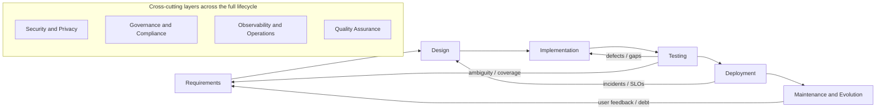
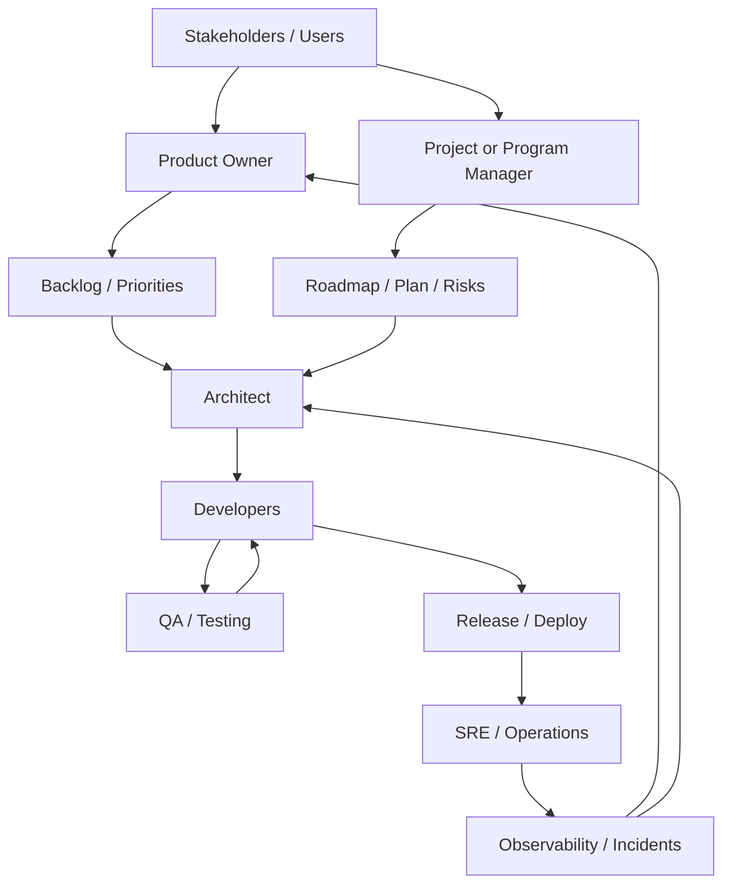

# Comprehensive Software Engineering Methodology

## Purpose

This document is an AI-readable synthesis of software engineering methodology foundations.

Its goal is to preserve the ideas of the original research-oriented source while making the content easier for an AI system to parse, recall, and apply consistently.

This version intentionally:

- keeps the original conceptual meaning,
- translates all content into English,
- removes noisy research-workflow markers such as inline citation tokens and image placeholders,
- and reorganizes the material into stable sections, decision-oriented tables, and explicit reference notes.

This document should be used as:

- a methodological foundation,
- a vocabulary and framing aid,
- a lifecycle and governance reference,
- and a cross-project engineering heuristic base.

This document should not be used as:

- the active product source of truth,
- the active architecture source of truth,
- or a substitute for project-specific manifests and decisions.

## Executive Summary

Software engineering can be understood as an engineering discipline focused on building, operating, and evolving software systems in a way that is reliable, secure, measurable, and sustainable, while balancing business constraints such as value, time, and cost with technical constraints such as quality, performance, maintainability, and risk.

In modern practice, the scope is broader than "programming." It includes:

- processes,
- artifacts,
- roles,
- metrics,
- governance,
- security,
- architecture,
- and operations across the full lifecycle.

This view aligns with bodies of knowledge such as SWEBOK and with families of standards that define processes, vocabulary, requirements, architecture, testing, measurement, quality, and maintenance.

From an analytical perspective, the lifecycle should be treated as a feedback system:

- requirements,
- design,
- implementation,
- testing,
- deployment,
- maintenance and evolution.

Each phase produces deliverables and metrics that inform the next phase, but also sends signals backward to correct earlier assumptions. For example:

- testing findings refine requirements,
- operational incidents force redesign,
- and maintenance reality exposes architectural debt.

Lifecycle standards emphasize that these are composable processes, not one rigid model.

In methodology and practice, it is useful to separate:

- principles such as Agile,
- management frameworks such as Scrum and Kanban,
- technical practices such as TDD, BDD, and DDD,
- and operational capabilities such as DevOps and CI/CD.

High-performing teams combine these layers and evaluate them through delivery metrics, especially DORA-style metrics, to avoid the illusion of progress and instead measure real outcomes such as flow, stability, and recovery capability.

In quality, security, and governance, the dominant direction is to integrate controls from design through operation:

- quality models,
- testing standards,
- code review,
- static analysis,
- vulnerability management,
- software supply chain security,
- and organizational governance.

This has become more important due to software supply chain risk and compliance pressure.

In cost and schedule estimation, robust approaches combine:

- functional or technical sizing,
- cost and scale drivers,
- and empirical calibration through throughput, lead time, and historical data.

The key is not guessing. The key is building an estimation system that is calibrated, reviewable, and continuously updated by delivery evidence and risk signals.

Primary reference basis for this section:

- ISO/IEC TR 19759 (SWEBOK)
- ISO/IEC/IEEE 12207
- ISO/IEC 25010:2023
- NIST SP 800-218 (SSDF)
- Agile Manifesto
- Scrum Guide
- Kanban Guide
- DORA metrics

## 1. Definitions and Academic/Normative Frameworks

### 1.1 Practical Definition and Minimal Taxonomy

A useful practice-oriented definition is:

Software engineering is the systematic application of knowledge, methods, tools, and discipline to specify, build, verify, deploy, operate, and evolve software under explicit constraints and with explicit guarantees around quality and risk.

This view relies on three foundations:

1. bodies of knowledge,
2. standards,
3. process and organizational improvement frameworks.

To reduce ambiguity, these frameworks provide shared vocabulary and boundaries. A standardized vocabulary is especially useful because it reduces semantic friction across:

- business,
- development,
- QA,
- operations,
- and audit or governance roles.

### 1.2 Major Academic and Normative Frameworks

- Body of knowledge:
  SWEBOK-aligned material defines the boundaries of the discipline and provides topic-based access to supporting literature.

- Lifecycle processes:
  ISO and IEEE publish lifecycle process standards such as ISO/IEC/IEEE 12207:2017 to define, control, and improve software lifecycle processes at organizational and project level without forcing a single delivery model.

- Requirements engineering:
  ISO/IEC/IEEE 29148:2011 complements lifecycle standards by defining requirements activities and requirements information items.

- Architecture and architecture documentation:
  ISO/IEC/IEEE 42010:2011 defines the conceptual model for architecture description, including views, viewpoints, and architectural description content.

- Testing:
  ISO/IEC/IEEE 29119 provides testing concepts, vocabulary, and process guidance intended to be usable across organizations and testing types.

- Measurement:
  ISO/IEC/IEEE 15939:2017 defines a measurement process for specifying what to measure, how to measure it, and how to validate the usefulness of the results.

- Product quality:
  ISO/IEC 25010:2023 defines a product quality model with nine characteristics and related subcharacteristics for specifying, measuring, and evaluating quality across the lifecycle.

- Unified vocabulary:
  ISO/IEC/IEEE 24765:2017 standardizes systems and software terminology.

- Maintenance:
  ISO/IEC/IEEE 14764:2022 provides maintenance guidance aligned to 12207 and defines maintenance categories explicitly.

- Software security:
  NIST SP 800-218, the Secure Software Development Framework, defines secure development practices that can be integrated into any SDLC.

- Organizational information security management:
  ISO/IEC 27001:2022 defines the requirements of an information security management system and its continual improvement model.

- Capability and maturity improvement:
  CMMI is used when an organization wants to institutionalize practices, assess capability, and sustain performance.

### 1.3 How These Frameworks Connect

- Lifecycle, requirements, architecture, testing, and measurement standards act as a structural skeleton for defining processes and artifacts.
- The product quality model provides a language for translating business demands such as reliability, security, performance, and maintainability into evaluable quality characteristics.
- SSDF and ISO 27001 integrate security as a cross-cutting practice, aligning software development with organizational risk management.
- CMMI is useful when the organization wants to institutionalize capability and improve repeatability over time.

Primary reference basis for this section:

- ISO/IEC TR 19759 (SWEBOK)
- ISO/IEC/IEEE 12207
- ISO/IEC/IEEE 29148
- ISO/IEC/IEEE 42010
- ISO/IEC/IEEE 29119
- ISO/IEC/IEEE 15939
- ISO/IEC 25010:2023
- ISO/IEC/IEEE 14764
- NIST SP 800-218
- ISO/IEC 27001
- ISO/IEC/IEEE 24765
- CMMI materials

## 2. Software Lifecycle

### 2.1 Lifecycle Model with Feedback Loops

This model is consistent with two important ideas:

- security must be inserted into any SDLC rather than treated as an optional side activity,
- and DevOps treats planning, development, delivery, and operation as interdependent phases rather than isolated silos.

### 2.2 Lifecycle Phases with Objectives, Deliverables, Artifacts, and Metrics

Methodological note:

Lifecycle standards such as 12207 describe processes and activities rather than a single canonical phase model. The table below uses a classical phase breakdown because it is the most common representation in practice and easy to connect to metrics and artifacts.

| Phase | Primary objective | Deliverables for decision-making | Typical artifacts as evidence and working material | Key metrics |
|---|---|---|---|---|
| Requirements | Align problem, scope, value, and constraints; define what "correct" means | Vision and scope, prioritized requirements, acceptance criteria, top risks | Backlog, stories or use cases, NFRs, traceability, prototypes | Requirement volatility, refinement lead time, percentage of stories with clear acceptance criteria, rework due to ambiguity |
| Design | Turn requirements into a solution through architecture, components, data, interfaces, and decisions | Target architecture, API contracts, data model, ADRs | Diagrams such as C4 or UML, ADRs, threat models, sketches, spikes, interface definitions | Structural complexity, expected NFR compliance by design, open technical risks, interface stability |
| Implementation | Build functional increments with quality discipline | Executable software increment, versioned changes, minimum operational documentation | Source code, pull requests or merge requests, scripts, infrastructure as code, containers, feature flags | Throughput and lead time from change to merge, batch size, rework rate, technical debt trend |
| Testing | Reduce uncertainty with evidence; validate behavior and non-functional attributes | Test reports, coverage or criteria evidence, verified defects | Unit, integration, and end-to-end suites, test data, CI results, plans and cases where applicable | Defect density, coverage with context, flakiness, pipeline cycle time, defect leakage to production |
| Deployment | Deliver changes to production in a controlled, repeatable, and reversible way | Releases, deployed changes, runbooks, configuration packages | CI/CD pipelines, manifests, versioned artifacts, rollback plans | Deployment frequency, change lead time, change failure rate, recovery time |
| Maintenance | Preserve usefulness and correctness over time through correction, adaptation, improvement, and prevention | Patches, improvements, migrations, retirement plans where needed | Incident handling, postmortems, refactoring, upgrades, knowledge base, runbooks | Recovery time, debt backlog, service stability, maintenance cost, maintenance type distribution |

### 2.3 Why These Metrics Matter

- Metrics do not replace judgment. They help detect signals such as growing flakiness, rising rework, or degrading stability.
- Metrics are useful when they close improvement loops through retrospectives, postmortems, prioritization, and architectural refinement.
- Robust measurement requires a real measurement process that defines what to measure, how to interpret it, and when to act.

Primary reference basis for this section:

- ISO/IEC/IEEE 12207
- ISO/IEC/IEEE 14764
- NIST SP 800-218
- DevOps guidance from major platform vendors
- DORA metrics

## 3. Methodologies and Practices

### 3.1 Conceptual Separation: Philosophy, Management, Capabilities, and Technical Practices

- Agile:
  a set of values and principles for responding to change and maximizing value through iterative delivery.

- Scrum:
  a framework for developing and sustaining complex products through defined roles, events, artifacts, and rules.

- Kanban:
  a strategy for optimizing flow through visualization, active management of work, and continuous improvement.

- DevOps:
  the integration of people, process, and technology across planning, development, delivery, and operation.

- CI/CD:
  automation for integrating, testing, packaging, releasing, and deploying changes frequently and reliably.

- TDD:
  a test-first technical practice in which tests guide design and implementation in short cycles.

- BDD:
  a behavior-focused evolution of Agile practices that emphasizes shared language and executable acceptance criteria.

- DDD:
  a domain modeling and design approach for complex systems, especially useful where language, business concepts, and bounded contexts matter.

### 3.2 Comparative Table of Methodologies and Practices

| Approach | What it is | Main advantages | Main risks or disadvantages | Recommended use cases |
|---|---|---|---|---|
| Agile | A value and principle system focused on adaptation and frequent value delivery | High adaptability, fast learning, better user alignment | Can collapse into nominal Agile without discipline; difficult without business participation | Products with uncertainty, innovation, and changing markets |
| Scrum | A framework with roles, events, artifacts, and minimal rules | Cadence, focus, transparency, inspection and adaptation, easier prioritization | Risk of ritualism; dependence on a strong Product Owner; may clash with highly unplanned work | Product development with a roadmap and iteration needs |
| Kanban | A flow optimization strategy based on visibility, WIP limits, active management, and improvement | Reduces multitasking, improves predictability, useful for support and operations | Can lack timeboxing and milestone pressure if applied poorly; requires flow metrics | Maintenance, support, and continuous-flow teams with high variability |
| DevOps | A cultural and operational approach connecting development and operations | Less friction, more frequent deployments, shared responsibility | Without automation and observability, it can create fatigue and operational risk | Products that run in production and need both speed and stability |
| CI/CD | End-to-end automation for build, test, package, release, and deploy | Lower deployment risk, faster delivery, earlier feedback | Risky when pipelines are unreliable; initial automation cost | Any system with frequent changes, including both monoliths and microservices |
| TDD | Writing tests before code to guide design | Better design pressure, fewer defects, living documentation in tests | Learning curve; fragile tests if the underlying design is poor | Complex domain logic, libraries, major refactoring work |
| BDD | Behavior-centered approach using ubiquitous language and executable acceptance tests | Better communication, fewer misunderstandings, business-technology bridge | Risk of over-specification; expensive if confused with broad end-to-end testing | Systems with complex business rules and business-development friction |
| DDD | Strategic and tactical modeling of complex domains | Controls complexity, supports modular architecture, improves domain alignment | Can be excessive for simple domains; requires deep collaboration with domain experts | Rich domains such as finance, logistics, health, and long-lived business systems |

### 3.3 Evaluating Success Without Dogma

A robust rule is to measure outcomes rather than activity.

DORA-style metrics help measure both throughput and instability, including:

- change lead time,
- deployment frequency,
- failed deployment recovery time,
- change failure rate,
- rework rate.

These metrics are useful only when applied carefully. Common failure modes include:

- Goodhart-style misuse,
- invalid comparisons across very different teams or systems,
- and targets that reward gaming rather than better outcomes.

Primary reference basis for this section:

- Agile Manifesto
- Scrum Guide
- Kanban Guide
- DevOps guidance
- CI/CD guidance
- Martin Fowler on TDD
- Dan North on BDD
- Domain Language and DDD materials
- DORA metrics

## 4. Tools and Selection Criteria by Phase

### 4.1 Vendor-Neutral Selection Criteria That Often Predict Success

When evaluating tools such as IDEs, version control, CI/CD, planning tools, testing frameworks, or monitoring platforms, the criteria that best predict sustained value usually include:

- Integration:
  APIs, plugins, webhooks, and automation friendliness.

- Standardization and interoperability:
  export formats, ecosystem compatibility, and standards alignment.

- Security and governance:
  access control, auditability, policy support, and compatibility with secure development practices.

- Operational reliability:
  observability, resilience, rollback support, and progressive delivery support.

- Total cost:
  licensing, operation, training, migration, and ownership cost rather than sticker price alone.

- Community and support:
  especially important in open source ecosystems where release cadence, maintenance health, and documentation quality matter.

- Alignment with the value stream:
  whether the tool reduces real friction or merely adds bureaucracy.

### 4.2 Recommended Tool Map by Phase

| Phase | Tool categories | Common examples | What to validate before choosing |
|---|---|---|---|
| Requirements | Product and project management, documentation, prototyping | Jira, Azure DevOps Boards, issue trackers, wikis | Traceability, approval flow, reporting, repository and CI integration |
| Design | Modeling and diagramming, ADR repositories, threat modeling | Diagramming tools, ADR repositories, architecture tooling | Ability to version outputs, diff changes, connect decisions to risks, support architecture views and viewpoints |
| Implementation | IDEs, version control, code review, build tooling | VS Code, IntelliJ, Visual Studio, Git, pull requests, linters | Productivity, language support, extensions, branch policy, change traceability |
| Testing | Unit, integration, and end-to-end frameworks, reporting, test data | JUnit, pytest, Cypress, Playwright, Selenium | Flakiness, execution time, parallelization, evidence quality, test observability |
| Deployment | CI/CD, artifact repositories, containers, orchestration, IaC | GitHub Actions, GitLab CI, Jenkins, Docker, Kubernetes, Terraform | Reproducibility, pipeline security, environment separation, rollback, secret management |
| Operations and maintenance | Observability, alerting, incident response, security tools | OpenTelemetry, Prometheus, Grafana, Sentry, PagerDuty | SLIs and SLOs, recovery time, runbooks, incident management, postmortems, governance alignment |

### 4.3 Official Documentation Categories

- IDEs:
  official documentation for Visual Studio Code, IntelliJ IDEA, and Visual Studio.

- Version control:
  official Git documentation.

- CI/CD:
  GitHub Actions, GitLab CI/CD, Jenkins, and reference explanations of CI/CD concepts.

- Containers and orchestration:
  Docker and Kubernetes documentation.

- Infrastructure as code:
  Terraform documentation.

- Work management:
  Jira Software and Azure DevOps documentation.

- Quality and static analysis:
  SonarQube and CodeQL documentation.

- Testing:
  JUnit, pytest, Cypress, Playwright, and Selenium documentation.

- Observability:
  OpenTelemetry, Prometheus, Grafana, Sentry, and PagerDuty documentation.

Primary reference basis for this section:

- official documentation for Git
- GitHub Actions
- GitLab CI/CD
- Jenkins
- Docker
- Kubernetes
- Terraform
- Jira
- Azure DevOps
- SonarQube
- CodeQL
- OpenTelemetry
- Prometheus
- Grafana
- pytest
- JUnit
- Cypress
- Playwright
- Selenium
- PagerDuty
- Sentry

## 5. Roles, Skills, and Team Organization

### 5.1 Organizational Design Principle

A strong team structure minimizes handoffs and maximizes shared responsibility.

Modern practice converges on reducing silos:

- DevOps emphasizes collaboration across historically separated roles such as development, operations, quality, and security,
- and SRE treats operations as a software problem, with emphasis on availability, latency, performance, and capacity.

### 5.2 Mermaid Diagram of Typical Role Relationships

### 5.3 Roles, Responsibilities, Skills, and Success Signals

| Role | Responsibilities | Technical and business competencies | Artifacts or success signals |
|---|---|---|---|
| Product Owner | Maximize value, prioritize, define acceptance criteria, manage backlog | Product vision, discovery, prioritization, negotiation, value metrics | Healthy backlog, clear acceptance criteria, lower rework due to ambiguity |
| Project or Program Manager | Manage scope, schedule, risk, coordination, and reporting | Risk management, communication, planning, basic finance awareness | Realistic roadmap, visible risks, low surprise, timely decisions |
| Software Architect | Define structure, components, data, interfaces, decisions, and trade-offs | Architecture, modeling, performance, security by design, integration strategy | Documented architecture, ADRs, NFR compliance evidence |
| Developer | Implement features, fix bugs, contribute to quality, automate where useful | Stack mastery, design, testing, performance, CI/CD, basic security literacy | Small pull requests, useful tests, low lead time, low defect leakage |
| QA or Test Engineer | Define test strategy, automate tests, ensure evidence quality, drive systematic quality | Test design, automation, test data, failure analysis | Effective coverage, controlled flakiness, fewer escaped defects |
| SRE | Operate for reliability, monitoring, alerting, capacity, incident response, and improvement | Observability, automation, resilience, postmortems, SLOs | Better recovery times, learning-focused incident handling, traceable SLOs |

Primary reference basis for this section:

- Scrum Guide
- DevOps guidance
- Google SRE materials
- DORA metrics

## 6. Quality, Security, and Governance

### 6.1 Quality Model, Testing Strategy, and Assurance

The product quality model defines characteristics used to specify and evaluate quality across the lifecycle. The 2023 edition explicitly reinforces its usefulness for:

- developers,
- acquirers,
- and quality assurance roles.

The ISO/IEC/IEEE 29119 series aims to provide internationally agreed testing concepts, vocabulary, and process guidance that can be applied in any organization.

A robust intermediate-to-advanced testing strategy usually combines:

- a test pyramid with many unit and integration tests and fewer end-to-end tests, adjusted by risk,
- non-functional testing mapped to quality attributes such as performance, security, reliability, and usability,
- and continuous evidence via CI, including results, flakiness trends, and coverage with context.

### 6.2 Code Review and Change Control as Technical Governance

The primary purpose of code review is to improve long-term code health.

Modern review practice usually treats pull request reviews as the central collaboration mechanism for:

- commenting,
- suggesting changes,
- approving,
- or requesting revisions before merge.

Common governance practices include:

- pull request or merge request policies,
- required reviews,
- required checks such as tests, lint, and SAST,
- limits on PR size,
- traceability from issue to PR to build to release to production change,
- and configuration and change control aligned to lifecycle and maintenance practices.

### 6.3 Security: Secure SDLC, OWASP, and Supply Chain Security

The Secure Software Development Framework proposes a set of secure development practices designed to integrate into any SDLC.

This matters because many lifecycle models do not describe security in enough detail on their own.

For web application risk awareness, OWASP Top 10 remains a major reference for common classes of security problems, including:

- insecure design,
- misconfiguration,
- integrity and supply chain issues,
- and other recurring failure modes.

For software supply chain security:

- SLSA defines progressive levels of software supply chain integrity assurance,
- SPDX and CycloneDX support SBOM transparency and risk reduction.

### 6.4 Vulnerability Management: Scoring and Data

- CVSS provides a standardized way to characterize a vulnerability and produce a severity score.
- NVD provides a standardized vulnerability data source useful for automation, vulnerability management, measurement, and compliance.

### 6.5 Compliance and Organizational Governance

ISO/IEC 27001 defines the requirements of an information security management system and its continuous improvement model.

It becomes especially important when software operates in:

- regulated environments,
- systems handling personal data,
- financial systems,
- health systems,
- or critical infrastructure contexts.

Primary reference basis for this section:

- ISO/IEC 25010:2023
- ISO/IEC/IEEE 29119
- NIST SP 800-218
- OWASP Top 10
- OpenSSF SLSA
- SPDX
- CycloneDX
- Google code review guidance
- GitHub pull request review guidance
- CVSS
- NVD
- ISO/IEC 27001

## 7. Metrics, Architecture, Estimation, and Risks

### 7.1 Metrics and KPIs for Progress, Quality, and Reliability

Core principle:

Measure to improve, not to punish.

DORA explicitly warns against:

- turning metrics into targets,
- comparing unlike systems or teams,
- and using metrics without contextual interpretation.

Delivery KPIs:

- change lead time,
- deployment frequency,
- failed deployment recovery time,
- change failure rate,
- rework rate.

Product quality KPIs:

- should align with the product quality model and its characteristics,
- should support non-functional acceptance criteria,
- and should support continuous evaluation rather than one-time reporting.

Security KPIs:

- SSDF control coverage,
- vulnerability exposure by severity and context,
- remediation time,
- and supply chain maturity through SLSA or SBOM adoption.

An implementation-ready instrumentation table:

| Domain | Metric | Suggested definition or measurement | Risk of misuse |
|---|---|---|---|
| Delivery | Change lead time | Commit to production deployment, measured per service or deployable unit | Optimizing by skipping controls |
| Delivery | Deployment frequency | Number of production deployments per period | Comparing teams with radically different contexts |
| Stability | Change fail rate | Percentage of deployments requiring immediate intervention | Hiding incidents to improve the number |
| Stability | Failed deployment recovery time | Time required to recover from a failed deployment | Defining recovery ambiguously |
| Quality | Defect leakage | Defects reaching production per release or period | Underreporting under pressure |
| Quality | Flakiness | Rate of intermittent test failures per suite | Inflating results by disabling tests |
| Security | Vulnerability MTTR | Time to remediate relative to severity and exploitability context | Looking only at severity without context |
| Supply chain | SBOM coverage | Percentage of components covered by SPDX or CycloneDX SBOMs | Treating SBOM as a checklist with no operational use |
| Observability | Telemetry coverage | Percentage of relevant traces, metrics, and logs instrumented | Instrumenting without a purpose, creating noise |

### 7.2 Architectural and Design Patterns

Architecture should be described formally through architectural descriptions, views, viewpoints, constraints, and decisions such as ADRs.

Common architectural styles:

| Pattern or style | Short description | When it fits | Typical trade-offs |
|---|---|---|---|
| Microservices | Collection of small autonomous services, usually aligned to business capabilities or bounded contexts | Organizational scaling, clear domains, independent deployment | Distributed complexity, observability burden, data consistency issues, governance overhead |
| Event-driven architecture | Producers emit events and consumers react through brokers or channels | Asynchronous integration, high throughput, near-real-time processing | Traceability difficulty, idempotency issues, ordering concerns, eventual consistency |
| Modular monolith | One deployable unit with internal module boundaries | Small to medium teams that need operational simplicity | Risk of internal coupling without discipline, single deployment unit |
| Hexagonal architecture | Domain isolated behind ports and adapters for infrastructure, UI, and data concerns | Systems with strong integration pressure and high testability needs | Requires discipline, more initial structural code |
| Clean Architecture | Dependency rules point inward toward the domain, with clear boundaries | Long-lived products that need maintainability and evolvability | Can be excessive for small projects, requires judgment |

Design patterns act as micro-architecture. Examples include:

- Strategy for swappable algorithms,
- Factory for decoupled object creation,
- Observer for in-memory publish-subscribe behavior.

### 7.3 Cost and Schedule Estimation

Recommended view:

Estimation should be treated as a calibrated system, not as a single number.

In mature organizations, estimation combines:

1. sizing:
   functional points, SLOC, or technical proxies,
2. parametric modeling:
   converting size and cost drivers into effort, cost, and schedule,
3. empirical control:
   adjusting forecasts using real throughput, lead time, rework, and defect data.

Main techniques and models:

- COCOMO II:
  a parametric model for cost, effort, and schedule estimation with multiple submodels depending on project maturity.

- Function points:
  a functional sizing approach promoted by IFPUG and useful when comparing productivity across technology stacks.

A rigorous open estimation model should usually present:

- optimistic, likely, and pessimistic ranges,
- a clear separation between build cost and run cost,
- and explicit risk multipliers for requirement uncertainty, technical debt, integration difficulty, and compliance burden.

### 7.4 Common Risks and Practical Mitigations

| Risk | Early measurable symptom | Practical mitigation |
|---|---|---|
| Requirement volatility or ambiguity | High rework, many reopened stories | Continuous refinement, acceptance criteria, BDD where useful |
| Accumulating technical debt | Rising lead time, more bugs, more flakiness | Explicit refactoring budget, focused TDD, debt and code health metrics |
| Unstable pipelines | Slow CI, false negatives, fear of deployment | Reduce batch size, stabilize tests, improve pipeline observability |
| Supply chain risk | Opaque dependencies, package-related incidents | SBOM adoption, SLSA levels, dependency scanning |
| Vulnerabilities without prioritization | Large CVE backlog, delayed patching | Severity plus exploitability context, NVD data, remediation SLAs |
| Reactive operations | Repeated incidents, high recovery time | SRE practices, observability, runbooks, postmortems, incident response |

### 7.5 Mini Bibliographic Manifest by Concept

This manifest covers the core concepts referenced throughout this document. It prioritizes primary standards and official documentation where possible.

| Concept | Essential bibliographic and technical references |
|---|---|
| Body of knowledge and discipline boundaries | ISO/IEC TR 19759:2015 (SWEBOK) |
| Standard vocabulary | ISO/IEC/IEEE 24765:2017 |
| Lifecycle processes | ISO/IEC/IEEE 12207:2017 |
| Requirements engineering | ISO/IEC/IEEE 29148:2011 |
| Architecture descriptions | ISO/IEC/IEEE 42010:2011 |
| Testing concepts and processes | ISO/IEC/IEEE 29119 series |
| Measurement process | ISO/IEC/IEEE 15939:2017 |
| Product quality model | ISO/IEC 25010:2023 |
| Maintenance guidance and categories | ISO/IEC/IEEE 14764:2022 |
| Secure SDLC | NIST SP 800-218 (SSDF) |
| Organizational information security management | ISO/IEC 27001 |
| Common web risk awareness | OWASP Top 10 |
| Supply chain security assurance | OpenSSF SLSA |
| SBOM standards and formats | SPDX and CycloneDX |
| Vulnerability severity scoring | FIRST CVSS |
| Vulnerability data | NIST NVD |
| Code review guidance | Google Engineering Practices: Code Review |
| Pull request collaboration | GitHub PR review guidance |
| Agile values | Manifesto for Agile Software Development |
| Scrum | Scrum Guide |
| Kanban | Kanban Guide |
| DevOps | DevOps guidance from major platform vendors |
| CI/CD definition | AWS and platform CI/CD documentation |
| Delivery performance metrics | DORA metrics |
| TDD | Martin Fowler on Test-Driven Development |
| BDD | Dan North on Introducing BDD |
| DDD | Domain Language and DDD reference materials |
| SRE | Google SRE materials |
| Observability instrumentation | OpenTelemetry documentation |
| Monitoring and alerting | Prometheus and Grafana documentation |
| Incident response | PagerDuty incident response guidance |
| Parametric estimation | COCOMO II |
| Functional sizing | IFPUG Function Point Analysis |
| Microservices architecture | Microsoft Azure Architecture Center microservices style |
| Event-driven architecture | Microsoft Azure Architecture Center event-driven style |

## Final Reading Frame for AI Systems

If this document is used to support framework or product reasoning, the safest summary is:

- software engineering is lifecycle engineering,
- lifecycle work is a feedback system rather than a one-way pipeline,
- architecture, quality, security, and governance are first-class concerns,
- methodology should be layered rather than treated as one monolithic approach,
- metrics should be used for calibration and improvement rather than punishment,
- and reusable scaffolding is stronger when it separates stable architectural concerns from product-specific intent.
