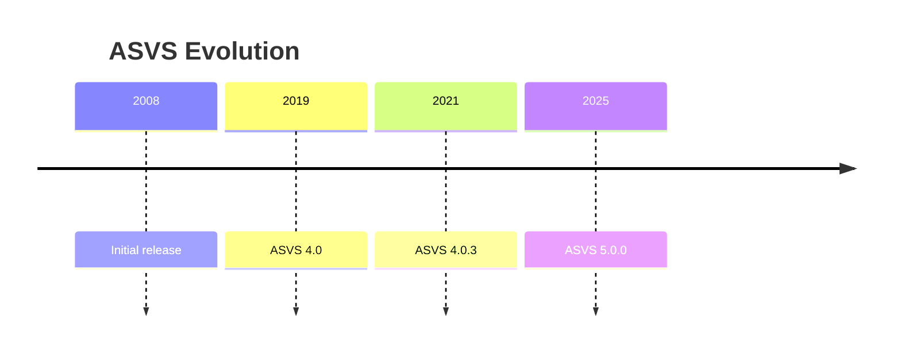
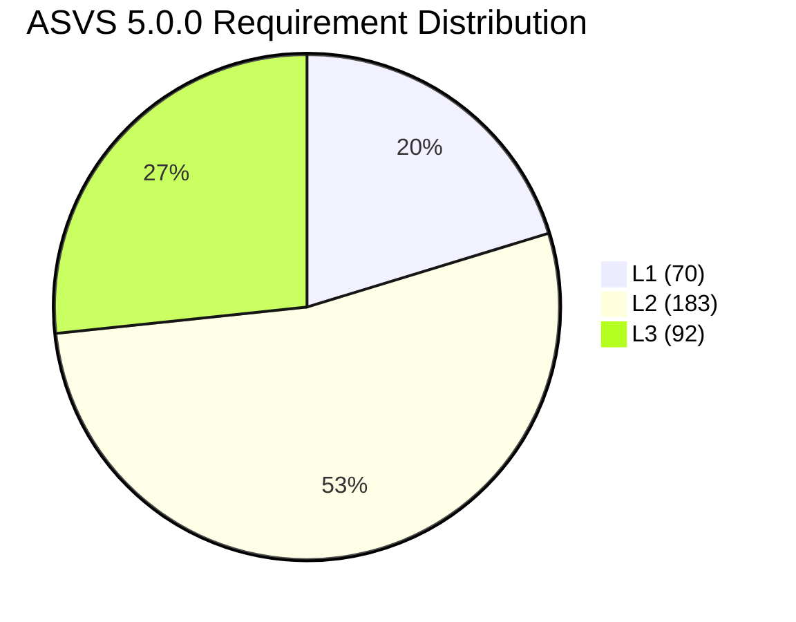
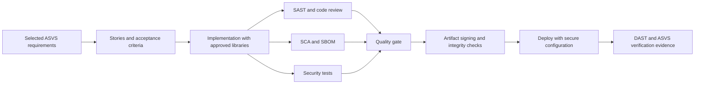

# OWASP ASVS Reference

## Purpose

This document is an AI-readable knowledge-base entry about the OWASP Application Security Verification Standard, or ASVS.

It preserves the ideas of the original research document while restructuring them into a stable factual reference suitable for manual refresh as standards and official guidance evolve.

Use this file as:

- a factual reference on ASVS structure and intent,
- a practical bridge between ASVS and implementation patterns,
- and a mapping aid across adjacent standards and security frameworks.

Do not use this file as:

- a legal or certification claim,
- a substitute for reading the official standard,
- or a universal checklist that applies unchanged to every system.

## Executive Summary

OWASP ASVS is an open standard of verifiable security requirements for web applications and web services.

Its defining characteristic is that it focuses on testable security outcomes rather than vague best-practice advice.

According to the source material used here, the latest stable version identified in official sources is:

- ASVS 5.0.0,
- released in May 2025.

ASVS 5.0 is a major restructuring relative to the 4.x line.

It organizes roughly 350 requirements across:

- 3 levels,
- and 17 chapters.

Based on the official 5.0.0 CSV corpus cited in the original research, the requirement counts are:

- 70 requirements at L1,
- 183 requirements at L2,
- 92 requirements at L3,
- 345 total.

ASVS also makes several governance boundaries explicit:

- OWASP does not certify products, vendors, or verifiers,
- third-party "ASVS certification" claims are not official OWASP endorsements,
- ASVS defines what should be verified, not one prescribed implementation technology,
- and ASVS works best when paired with implementation and testing guidance such as the OWASP Cheat Sheet Series and the OWASP Web Security Testing Guide.

For mobile systems, the better OWASP counterparts are:

- MASVS,
- and MASTG.

ASVS is best positioned for:

- backend systems,
- web services,
- and APIs used by web or mobile clients.

## 1. Foundations, Purpose, and Evolution

ASVS is a security requirements standard for web applications and web services.

Its scope is primarily product-centric:

- application controls,
- service behavior,
- verifiable security requirements.

It does not define a full SDLC or CI/CD process by itself, although it should be evaluated alongside:

- CI/CD practice,
- hosting,
- operations,
- and broader secure development process controls.

OWASP positions ASVS as useful for:

- building more secure software,
- evaluating application security,
- providing a trust yardstick,
- and serving as a contractable procurement baseline.

### Historical Timeline



### Key 5.0 Changes

Important changes described in the source material include:

- a significant restructuring relative to 4.0.3,
- modernized chapter boundaries,
- explicit treatment of newer domains such as OAuth or OIDC, WebRTC, self-contained tokens, and frontend security,
- removal of the former architecture chapter due to scope and content redistribution concerns,
- and removal of direct built-in mappings to standards such as CWE or NIST from the core body of the standard in favor of a more sustainable external mapping approach through CRE or OpenCRE-style catalogs.

This means that ASVS 5.0 should be read as:

- a technical verification standard,
- not a self-contained universal crosswalk library.

## 2. Levels and Quantitative Structure

ASVS 5.0 defines three levels and explicitly recommends risk-based progression rather than universal mandatory use of the highest level for all systems.

### Level Comparison

| Level | Declared intent | Control profile | Practical verification implication |
|---|---|---|---|
| L1 | Minimal starting point with low adoption friction | Critical first-line controls against common attacks | Smaller scope, but not always demonstrable through black-box testing alone |
| L2 | Recommended target for most applications | Broader controls against less common attacks and more complex risks | Requires implementing all applicable L1 and L2 controls and stronger evidence |
| L3 | Highest assurance level | Defense-in-depth and advanced hardening controls | Usually requires deeper access to architecture, code, configuration, and operational evidence |

### Requirement Distribution



Interpretation:

- L1 is intentionally lightweight enough to act as a low-friction starting baseline,
- L2 represents the main target for most serious applications,
- and L3 represents a substantially higher verification and assurance burden.

## 3. Chapter Map

Based on the original research summary of the ASVS 5.0.0 CSV:

| Chapter | Domain | Requirement count |
|---|---|---:|
| V1 | Encoding and Sanitization | 30 |
| V2 | Validation and Business Logic | 13 |
| V3 | Web Frontend Security | 31 |
| V4 | API and Web Service | 16 |
| V5 | File Handling | 13 |
| V6 | Authentication | 47 |
| V7 | Session Management | 19 |
| V8 | Authorization | 13 |
| V9 | Self-contained Tokens | 7 |
| V10 | OAuth and OIDC | 36 |
| V11 | Cryptography | 24 |
| V12 | Secure Communication | 12 |
| V13 | Configuration | 21 |
| V14 | Data Protection | 13 |
| V15 | Secure Coding and Architecture | 21 |
| V16 | Security Logging and Error Handling | 17 |
| V17 | WebRTC | 12 |

The practical meaning of this structure is that ASVS is intended to be:

- selectively applicable by chapter,
- not blindly applied chapter-for-chapter to all systems.

For example:

- an API-only backend may ignore some frontend-specific concerns,
- a system without OAuth can omit OAuth-specific verification,
- and a system without WebRTC should not inherit unnecessary WebRTC controls.

## 4. Control Domains and Practical Implementation Patterns

This section translates major ASVS domains into concrete implementation patterns without turning the standard into one technology prescription.

### 4.1 Input Validation, Encoding, Sanitization, and Injection Resistance

ASVS explicitly separates:

- validation of input and business logic expectations,
- from encoding, escaping, and sanitization needed to prevent untrusted data from being interpreted by dangerous interpreters such as SQL engines, browsers, shells, or template engines.

Practical patterns:

- positive validation in a trusted service layer,
- parameterized database access,
- context-specific output encoding,
- SSRF defenses through strict protocol, host, and port allowlists,
- anti-automation controls such as rate limits and adaptive friction.

Illustrative pseudocode:

```text
function handleRequest(req):
  input = parse(req)
  assert matchesSchema(input)
  assert businessRulesHold(input)
  assert notAbusive(req.subject, req.rate)

  rows = db.query(
    "SELECT * FROM orders WHERE user_id = ? AND order_id = ?",
    [req.userId, input.orderId]
  )

  return renderHTML(escapeHTML(rows))
```

### 4.2 Authentication

ASVS authentication controls emphasize resistance to:

- impersonation,
- password interception,
- brute force,
- and credential stuffing.

The source material also highlights modern hygiene such as:

- allowing password managers,
- avoiding unnecessary composition complexity,
- avoiding forced periodic rotation without evidence of compromise,
- and requiring MFA at stronger assurance levels.

Practical patterns:

- adaptive anti-automation behavior,
- password verification with strong hashing,
- MFA and step-up for sensitive actions,
- explicit logging of authentication successes and failures.

Illustrative pseudocode:

```text
function login(username, password, context):
  if rateLimitExceeded(username, context.ip):
    return challengeOrDelay()

  user = users.find(username)
  if user == null:
    logAuthFailure(username, context)
    return invalidCredentials()

  if not verifyPasswordHash(password, user.passwordHash):
    logAuthFailure(username, context)
    return invalidCredentials()

  if requiresMFA(user, context):
    otp = promptSecondFactor()
    if not verifySecondFactor(user, otp):
      logAuthFailure(username, context)
      return invalidSecondFactor()

  session = newSession(user)
  logAuthSuccess(user.id, context)
  return session
```

### 4.3 Session Management and Browser Security

ASVS distinguishes:

- session management,
- self-contained tokens,
- and browser-side security controls such as cookies and headers.

Practical patterns:

- backend-enforced session validation,
- session invalidation on logout or expiration,
- secure cookie attributes such as `Secure`, `HttpOnly`, and appropriate `SameSite`,
- browser protections such as HSTS, CSP, and strict CORS allowlisting,
- early revocation strategies for self-contained tokens when risk requires it.

Illustrative pseudocode:

```text
function newSession(user):
  sid = csprng(32 bytes)
  storeSession(sid, user.id, issuedAt=now(), expiresAt=policy.expiresAt(user))
  setCookie("sid", sid, Secure=true, HttpOnly=true, SameSite=policy.sameSite)
  return sid

function logout(sid):
  invalidateSessionInBackend(sid)
  setCookie("sid", "", expires=PastDate)
```

### 4.4 Authorization

ASVS authorization controls emphasize:

- least privilege,
- documented access rules,
- object-level authorization,
- field-level authorization,
- function-level authorization,
- and centralized enforcement in a trusted layer.

Practical pattern:

```text
function authorize(subject, action, resource, context):
  rules = policy.getRules(action, resource.type)

  if not rules.objectAccessAllowed(subject, resource, context):
    logAuthZFailure(subject, action, resource, context)
    return DENY

  if rules.requiresStepUp(subject, action, resource, context):
    if not subject.hasFreshReauth():
      return CHALLENGE_STEP_UP

  return ALLOW
```

### 4.5 Cryptography, Secure Communication, and Data Protection

ASVS treats these as distinct but related domains:

- general cryptographic practice,
- secure communication,
- and protection of sensitive data.

Key patterns highlighted by the source material:

- cryptographic agility,
- use of vetted libraries,
- authenticated encryption,
- minimum acceptable security strength,
- constant-time handling where needed,
- safe failure modes,
- explicit data sensitivity classification.

Illustrative pseudocode:

```text
function encrypt(plaintext, aad, keyId):
  key = keyManager.getKey(keyId)
  nonce = csprngNonce()
  (ciphertext, tag) = AEAD_Encrypt(key, nonce, plaintext, aad)
  return {keyId, nonce, ciphertext, tag}

function rotateKeys():
  keyManager.generateNewKey()
  reencryptDataGradually()
```

### 4.6 Security Logging and Error Handling

ASVS treats security logs as a distinct control surface, not as ordinary performance logs.

Important principles:

- capture security-significant events,
- keep logs structured,
- support analysis tooling,
- avoid leakage of secrets or sensitive values,
- treat logs as sensitive assets themselves,
- use consistent timestamps such as UTC.

Illustrative pseudocode:

```text
logSecurityEvent({
  ts: nowUTC(),
  event: "AUTHZ_DENY",
  actorId: subject.id,
  action: action,
  resourceId: resource.id,
  srcIp: context.ip,
  sessionTokenHash: hashPrefix(session.token)
})
```

### 4.7 Configuration, Supply Chain, and CI/CD

ASVS requires secure default configuration and also contains explicit modern supply chain controls such as:

- inventory and SBOM expectations,
- trusted repositories,
- remediation timeframes by risk,
- dependency confusion defenses,
- and isolation or sandboxing for dangerous functionality.

ASVS does not prescribe one CI/CD model, but it fits naturally with process complements such as NIST SSDF.

Illustrative pipeline pattern:



### 4.8 APIs and Services

ASVS includes explicit API and service concerns such as:

- HTTP message validation,
- prevention of request smuggling and header injection,
- GraphQL complexity and introspection limits,
- WebSocket origin and token validation,
- and message-size controls to resist denial-of-service conditions.

Illustrative GraphQL pattern:

```text
function handleGraphQL(query, variables):
  cost = estimateQueryCost(query, variables)
  if cost > MAX_COST or depth(query) > MAX_DEPTH:
    return 429_or_400()
  if isProduction() and isIntrospection(query) and not allowedIntrospection():
    return 403()
  return execute(query, variables)
```

## 5. Analytical Mappings to Other Standards and Frameworks

ASVS 5.0 removed direct built-in mappings, so the mappings below should be understood as analytical alignment rather than one-to-one official crosswalks.

### 5.1 Mapping to OWASP Top 10

| OWASP Top 10 area | Most related ASVS chapters | Reason |
|---|---|---|
| Broken Access Control | V8, V7, V6, V4 | Authorization, session, authentication, and API boundary controls |
| Security Misconfiguration | V13, V3, V4 | Configuration, frontend protections, and service message validation |
| Software Supply Chain Failures | V15, V13 | SBOM, trusted repositories, dependency controls, and configuration |
| Cryptographic Failures | V11, V14, V12 | Cryptography, data protection, secure transport |
| Injection | V1, V2, V4 | Encoding, validation, parameterization, HTTP validation |
| Insecure Design | V15, V2 | Secure architecture and business-rule validation patterns |
| Authentication Failures | V6, V7, V10, V9 | Authentication, sessions, OAuth/OIDC, tokens |
| Software or Data Integrity Failures | V15, V11, V16 | Supply chain integrity, crypto, and auditability |
| Logging and Alerting Failures | V16 | Security event logging and error-handling controls |
| Mishandling of Exceptional Conditions | V16, V13 | Safe failures and secure operational configuration |

### 5.2 Mapping to NIST

Useful adjacent NIST references include:

- NIST SP 800-53 for control families,
- NIST 800-63 for identity guidance,
- NIST SSDF for secure development process guidance.

The practical interpretation is:

- ASVS provides product-level verification requirements,
- NIST SSDF provides process-level secure development practices,
- NIST 800-53 provides broader control families,
- and NIST 800-63 is especially relevant for authentication and identity lifecycle concepts.

### 5.3 Mapping to ISO 27001 and ISO 27002

Practical reading:

- ISO 27001 and 27002 operate at governance and control-management level,
- ASVS operates as a technical verification standard for software products.

This makes them complementary rather than interchangeable.

### 5.4 Mapping to PCI DSS

Relevant alignment patterns:

- ASVS cryptography, communication, and data protection controls overlap strongly with payment-data protection concerns,
- configuration and supply chain controls matter in payment environments,
- and logging controls support traceability and evidence.

### 5.5 Mapping to Weakness Taxonomies

ASVS chapters such as:

- V1,
- V2,
- V6,
- V7,
- and V8

align naturally with recurring weakness families surfaced by CWE Top 25-style analyses.

## 6. Verification, Metrics, and Common Pitfalls

### 6.1 Verification Approach

ASVS is deliberately not fully prescriptive about how to verify every control, but serious verification usually combines:

- document review,
- code and configuration review,
- manual testing guided by sources such as WSTG,
- automated regression checks in CI/CD,
- and explicit evidence mapping from requirement to proof.

### 6.2 Useful KPIs

Because ASVS is intended to function as a yardstick, useful metrics are requirement-oriented and actionable.

Examples:

- applicable ASVS coverage by level,
- chapter compliance by threat-priority area,
- percentage of controls with automated evidence versus manual-only evidence,
- MTTR for ASVS findings,
- supply chain debt,
- structured logging coverage for critical security events.

### 6.3 Common Failure Modes

- Treating ASVS as a universal checklist:
  mitigation requires explicit applicability decisions and traceability.

- Treating validation as a substitute for encoding or parameterization:
  mitigation requires keeping those concerns separate.

- Using sessions or self-contained tokens without a revocation strategy:
  mitigation requires explicit invalidation patterns.

- Turning logs into a new secret store:
  mitigation requires minimization, masking, hashing, retention control, and access governance.

- Running a supply chain without real inventory:
  mitigation requires SBOMs, trusted sources, remediation windows, and pipeline gates.

## 7. Empirical and Practical Evidence

The source material notes that direct "ASVS causes fewer breaches" evidence is difficult to standardize across contexts.

However, there is evidence of ASVS being used as:

- a structuring framework for security evaluation,
- a teaching framework for security education,
- and a basis for more quantitative evaluation models.

The strongest safe interpretation is:

- ASVS is clearly useful as a structured verification framework,
- but organization-specific evidence should still be collected locally.

## Final Reading Frame for AI Systems

The safest summary of ASVS is:

- it is a product-level verification standard for web applications and web services,
- it defines what should be verified rather than one mandatory implementation recipe,
- it should be scoped by applicability and assurance level,
- it works best when paired with implementation and testing guidance,
- and it is strongest when used as an evidence-based verification baseline rather than as a vague checklist.

## Reference Basis to Refresh Manually

When refreshing this file against the state of the art, prioritize checking:

- the official ASVS repository and stable release information,
- official chapter definitions and CSV exports,
- OWASP statements on certification and verification scope,
- OWASP Top 10 updates,
- MASVS and MASTG updates for mobile,
- WSTG and Cheat Sheet Series changes,
- NIST 800-53, NIST 800-63, and SSDF developments,
- ISO 27001 and 27002 developments,
- PCI DSS updates,
- and current CWE or SANS Top 25 publications.
