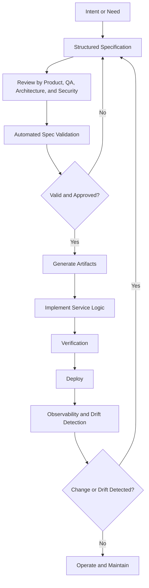

# Spec-Driven Development Foundations

## Purpose

This document is an AI-readable knowledge-base entry about Spec-Driven Development as an engineering discipline.

It preserves the ideas of the original research document while restructuring them into a stable factual reference that can be manually updated over time as the state of the art evolves.

Use this file as:

- a conceptual definition source,
- a map of historical roots,
- a comparison aid against adjacent practices,
- and a practical guide to operational SDD patterns.

Do not use this file as:

- the active project spec,
- the active architecture contract,
- or a substitute for concrete implementation rules in the repository.

## Executive Summary

Spec-Driven Development, or SDD, is an engineering approach in which a structured specification becomes the primary authoritative artifact of development.

In a strong SDD model:

- the specification is created first,
- implementation is derived from it or continuously validated against it,
- verification is organized around conformity to it,
- and governance mechanisms exist to control change and prevent drift.

The term has two important historical waves:

- an older wave rooted in formal methods, design by contract, and executable specifications,
- and a modern wave in 2025-2026 driven by AI agents, contract-first workflows, and the need to reduce ambiguity in machine-assisted coding.

The main benefits of SDD are:

- reduced ambiguity,
- less rework,
- easier parallelization through mocks and stubs,
- stronger interoperability through contracts,
- and more reliable AI-assisted workflows.

The main risks are:

- over-specification,
- bureaucracy,
- false confidence,
- and spec drift if there is no enforcement.

## 1. Operational Definition

A practical engineering definition of SDD is:

Spec-Driven Development is a paradigm in which:

1. a structured specification of system behavior or contract is produced first,
2. that specification becomes authoritative,
3. implementation, validation, testing, and governance are organized around conformity to that specification,
4. and evolution is managed through continuous feedback and explicit compatibility control.

This definition matters because it avoids reducing SDD to:

- OpenAPI alone,
- documentation-first habits,
- or tests written before code in only a narrow sense.

## 2. Rigor Spectrum

A useful way to reason about SDD is as a spectrum of authority.

### Spec-First

The specification guides the initial build, but may later become secondary.

Typical outcome:

- the spec is useful early,
- but the code often becomes the de facto source of truth again.

### Spec-Anchored

The specification remains alive alongside the code and is protected by automated checks intended to reduce divergence.

Typical outcome:

- specs remain relevant,
- but implementation may still involve significant manual interpretation.

### Spec-as-Source

Humans edit the specs and machines derive most of the implementation or artifact set from them.

Typical outcome:

- the specification is truly authoritative,
- and handwritten code is minimized or isolated to extension points.

This spectrum is useful because it forces teams to decide how much authority the spec should actually have instead of using the term SDD loosely.

## 3. Historical Roots

SDD did not originate with AI.

It has at least three major roots.

### 3.1 Formal Methods

Formal methods use mathematical specification and verification to reduce uncertainty in complex or critical systems.

Core contribution:

- a rigorous tradition in which specification and verification are central engineering acts rather than secondary documentation tasks.

### 3.2 Design by Contract

Design by Contract makes obligations and guarantees explicit through:

- preconditions,
- postconditions,
- invariants.

Core contribution:

- part of the specification becomes directly checkable at runtime or through tooling.

### 3.3 Formal Specification for Concurrency and Distributed Systems

TLA+ and related approaches reinforce the idea that writing specifications and models before implementation can expose concurrency errors, protocol flaws, and invariant violations that are difficult to discover through conventional testing alone.

### 3.4 Agile Specification-Driven Development

An early explicit pre-AI use of the term appears in work that combined:

- Test-Driven Development,
- and Design by Contract.

The key idea was that tests and contracts are complementary forms of specification.

## 4. Modern Repositioning of SDD

Two modern forces pushed SDD back into prominence.

### 4.1 Contract-First and API-First Engineering

OpenAPI and related contract systems made it practical to define:

- interfaces,
- schemas,
- documentation,
- mocks,
- code generation,
- and automated verification

from a language-agnostic contract.

### 4.2 AI-Agent Workflows

By 2025-2026, SDD became increasingly relevant in AI-assisted development because the main engineering bottleneck shifted:

- less effort was required to produce code,
- more effort was required to produce high-quality specifications that keep code generation aligned.

This made structured specs valuable as:

- context,
- constraints,
- acceptance criteria,
- and enforcement boundaries for coding agents.

## 5. Relationship to TDD, BDD, ATDD, and Specification by Example

SDD is best understood as a larger discipline that can incorporate these practices.

### TDD

TDD specifies behavior at the unit or component level by writing a test first and then implementing to satisfy it.

### BDD

BDD specifies system behavior at feature or user level through structured language and examples.

### ATDD

Acceptance Test-Driven Development specifies acceptance behavior before implementation through executable checks created collaboratively.

### Specification by Example

Specification by Example expresses requirements through concrete examples that can be turned into automated checks.

### Practical Distinction

The most useful distinction is:

- TDD, BDD, ATDD, and Specification by Example are languages and rituals for creating executable specifications at different levels,
- SDD is the discipline that makes those specifications govern the broader lifecycle, including generation, validation, and drift control.

### Given-When-Then as a Bridge

Given-When-Then acts as a practical bridge between:

- BDD,
- and Specification by Example.

It is valuable because it keeps behavior readable while remaining automatable.

## 6. Benefits, Risks, and Structural Limits

### Benefits

- Reduced ambiguity and rework:
  explicit contracts and examples move decisions earlier.

- Better parallelization:
  mocks, stubs, and generated artifacts allow frontend, integration, and testing work to start earlier.

- More repeatable artifact generation:
  specs can generate SDKs, stubs, docs, and scaffolding.

- Better compatibility between systems:
  consumer-provider expectations can be verified continuously.

- Better AI reliability:
  explicit contracts reduce plausible-but-wrong outputs from coding agents.

### Risks and Limits

- Spec drift:
  the spec diverges from reality if it is not enforced in CI or workflow gates.

- False sense of security:
  a well-formed contract does not automatically capture deep invariants, emergent behavior, or semantic correctness.

- Over-specification:
  trying to capture everything in exhaustive detail slows change and increases maintenance cost.

- New complexity surface:
  complexity moves into schema engineering, validation, code generation, and governance.

- Toolchain lock-in:
  teams can become dependent on specific editors, SaaS offerings, or generator ecosystems.

## 7. Closed-Loop SDD Workflow

The practical goal of SDD is not simply to write better documentation. The goal is to build a closed loop:

- intent,
- specification,
- validation,
- generation or implementation,
- verification,
- deployment,
- observability,
- drift detection,
- evolution.



This is the key difference between real SDD and documentation-first habits:

- the spec is versioned,
- validated,
- and tied to downstream enforcement.

## 8. Example Specification Shapes

### 8.1 Functional Spec Template

```md
# Spec: <Capability Name>

## Context
- What problem does it solve?
- Which actors are involved?

## Scope
- In scope:
- Out of scope:

## Domain Rules
- Rule 1:
- Rule 2:

## Examples and Edge Cases
- Example A:
- Example B:

## Non-Functional Requirements
- Security:
- Performance:
- Observability:

## Verifiable Acceptance Criteria
- AC1:
- AC2:

## Compatibility and Impact
- Breaking changes:
- Known risks:
```

### 8.2 BDD / Gherkin Example

```gherkin
Feature: Checkout
  As a customer
  I want to pay for my cart
  So that I can place an order

  Background:
    Given the cart has items
    And the user is authenticated

  Scenario: Successful payment with a valid card
    Given the card is valid
    When the user confirms payment
    Then an order is created
    And the payment is authorized
    And the user receives a confirmation
```

### 8.3 OpenAPI Contract Example

```yaml
openapi: 3.1.0
info:
  title: Orders API
  version: 1.0.0
paths:
  /orders:
    post:
      operationId: createOrder
      summary: Create an order
      responses:
        "201":
          description: Created
```

### 8.4 CDC Example with Pact in TypeScript

```ts
import { PactV3, MatchersV3 } from "@pact-foundation/pact";

const provider = new PactV3({
  consumer: "web-frontend",
  provider: "orders-service",
});
```

### 8.5 Schema-Based Testing Example with Schemathesis in Python

```py
import schemathesis

schema = schemathesis.from_path("openapi.yaml")

@schema.parametrize()
def test_api_conforms(case):
    response = case.call()
    case.validate_response(response)
```

These examples matter because they show that SDD is not one document format. It is a family of structured artifacts with different enforcement roles.

## 9. Toolchain Layers

An SDD toolchain is usually layered.

### Spec Languages

- OpenAPI for HTTP interfaces,
- AsyncAPI for event-driven interfaces,
- GraphQL schemas,
- JSON Schema for data structures,
- Gherkin for executable behavior scenarios.

### Authoring and Repository Layer

- editors such as Swagger Editor or Stoplight Studio,
- Git repositories,
- templates such as Spec Kit-style structures.

### Linting and Validation

- Spectral,
- Redocly CLI,
- schema validators,
- custom semantic checks.

### Mocking and Stubbing

- Prism,
- WireMock,
- generated stubs,
- interactive documentation tools.

### Code Generation

- OpenAPI Generator,
- ecosystem-specific generators,
- stub and SDK generators.

### Contract Testing

- Pact,
- Spring Cloud Contract,
- provider verification workflows.

### Test Execution

- Jest,
- pytest,
- Newman,
- schema-based runners such as Schemathesis.

## 10. Comparative Tool Table

| Tool | Role in SDD | Main strengths | Main limitations |
|---|---|---|---|
| OpenAPI Specification | HTTP contract language | Strong standardization and automation ecosystem | Does not capture all semantic invariants by itself |
| Spectral | Spec linting and style enforcement | Excellent for governance and CI gates | Requires rule design and ownership |
| Redocly CLI | Validation, linting, and bundling | Useful for larger and modular specs | Still only one part of the governance picture |
| Prism | Mocking and validation proxy | Enables early collaboration and fast feedback | Depends heavily on spec quality and examples |
| OpenAPI Generator | Artifact generation | Reduces repetitive work and standardizes edges | Requires clear boundaries between generated and handwritten code |
| Pact | Consumer-driven contract testing | Strong for real consumer-provider compatibility | Requires disciplined contract versioning and pipeline practice |
| Spring Cloud Contract | JVM-focused contract testing | Strong Spring ecosystem integration | Less portable outside JVM-heavy environments |
| Schemathesis | Schema-based testing | Excellent edge-case exploration from contracts | Requires good schemas and controlled test environments |
| Postman and Newman | Executable collections and CI checks | Easy collaboration and quick smoke/integration checks | Can diverge from the formal contract if not governed |
| Dredd | Spec-to-implementation conformance testing | Useful for direct conformance checks | Less central in modern toolchains than some alternatives |

## 11. Best-Fit Use Cases

SDD usually provides the most value in:

- microservices and integration-heavy systems,
- regulated sectors such as fintech or banking,
- systems with critical concurrency or distributed behavior,
- API-heavy platforms,
- and teams using AI agents to generate or modify code quickly.

These are the environments where:

- clear contracts,
- compatibility discipline,
- automated verification,
- and drift control

have unusually high leverage.

## 12. Metrics That Matter

SDD should not be evaluated by the amount of documentation produced.

More meaningful metrics include:

- drift rate:
  contract or schema conformance failures over time,

- contract coverage:
  proportion of important interactions covered by verifiable contracts,

- spec quality checks:
  linter findings and trend by category,

- onboarding time:
  time to first productive contribution,

- defect escape rate at system boundaries:
  integration or contract defects found late versus early,

- DORA-style delivery metrics:
  deployment frequency, lead time, recovery time, and change failure rate.

## 13. Governance and Adoption Model

### Recommended Role Split

- Product or business analysis:
  goals, examples, constraints, acceptance criteria.

- Engineering:
  operational specs, technical constraints, traceability between spec and code.

- QA:
  executable checks, acceptance collaboration, contract and schema-based testing strategy.

- Security and platform:
  governance rules, linting, versioning, CI gates, and security constraints.

### Minimum Viable Governance

- specs in version control with pull-request review,
- definition of done that includes updated spec and passing validation,
- explicit breaking-change policy,
- regeneration policy where generated artifacts exist,
- drift detection as an operational concern rather than an afterthought.

## 14. Stepwise Adoption for Teams

| Phase | Objective | Typical deliverables | Success signal |
|---|---|---|---|
| Alignment | Decide what "spec" means and how authoritative it is | Team guidance and updated definition of done | Shared definition adopted |
| First contract | Introduce one useful contract artifact | OpenAPI, AsyncAPI, or a small Gherkin set | Consumers can work from the spec |
| Validation in CI | Enforce basic spec quality | Linting and validation gates | Invalid specs block PRs |
| Early mocking | Enable parallel work | Mock server and reviewable examples | Frontend or consumers can proceed early |
| Inter-service contracts | Reduce integration breakage | CDC contracts and provider verification | Fewer incompatibility incidents |
| Code generation | Reduce repetitive manual work | SDKs, stubs, docs | Less boilerplate and less manual sync |
| Hardened quality | Catch edge cases and drift earlier | Schema-based tests and trend monitoring | More issues found before production |
| Ongoing governance | Sustain evolution without drift | Ownership rules, metrics, compatibility policy | Better delivery stability and lower drift |

## Final Reading Frame for AI Systems

The safest summary of SDD is:

- it is broader than API-first or test-first alone,
- it becomes real only when specifications are authoritative and enforced,
- it works best as a closed-loop engineering system,
- and its value rises sharply in integration-heavy, regulated, or AI-assisted environments.

## Reference Basis to Refresh Manually

When refreshing this file against the current state of the art, prioritize developments in:

- formal methods and executable specifications,
- Design by Contract,
- TLA+ and formal verification practice,
- Thoughtworks and other industry positioning of SDD,
- GitHub Spec Kit and similar workflows,
- OpenAPI and AsyncAPI ecosystems,
- Pact and Spring Cloud Contract,
- schema-based testing tools such as Schemathesis,
- and modern writing on spec drift, contract governance, and AI-agent development.
